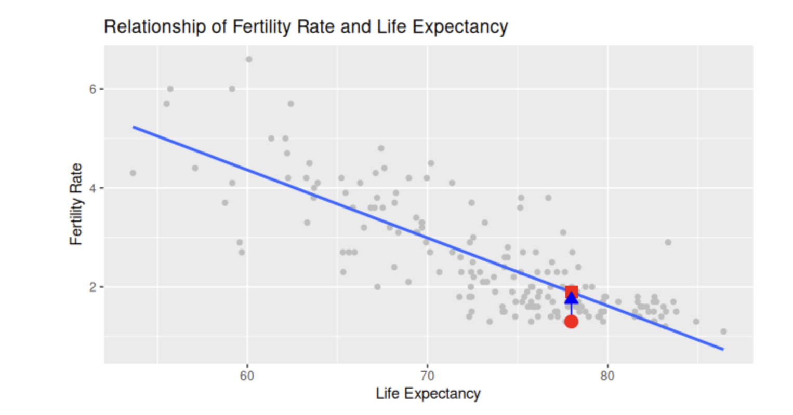

```{r}
library(tidyverse)
library(moderndive)
library(readr)
library(infer)
library(ISLR2)
 
UN_data_ch5 <- un_member_states_2024 |>
  select(iso, 
         life_exp = life_expectancy_2022, 
         fert_rate = fertility_rate_2022, 
         obes_rate = obesity_rate_2016)|>
  na.omit()
```

## To Read

ModernDive book - Chapter 5,6,10

<https://moderndive.com/v2/regression.html>

Modern Statistics book - Chapter 7,8, 24, 25

<https://openintro-ims.netlify.app/model-slr>

## Life expectancy and fertility rates

How do changes in life expectancy influence fertility rates

## Descriptive Statistics

```{r}
UN_data_ch5 |>
  summarize(mean_life_exp = mean(life_exp), 
            mean_fert_rate = mean(fert_rate),
            median_life_exp = median(life_exp), 
            median_fert_rate = median(fert_rate))

UN_data_ch5 |> 
  select(fert_rate, life_exp) |> 
  tidy_summary()
```

## Are life expectancy and fertility correlated?

```{r}
UN_data_ch5 |> 
  summarize(correlation = cor(fert_rate, life_exp))

ggplot(UN_data_ch5, 
       aes(x = life_exp, y = fert_rate)) +
  geom_point(alpha = 0.4) +
  labs(x = "Life Expectancy", y = "Fertility Rate")
```

## What does the correlation tell us

-   strength of linear association

```{r}
UN_data_ch5 |> 
  summarize(correlation = cor(fert_rate, life_exp))

ggplot(UN_data_ch5, 
       aes(x = life_exp, y = fert_rate)) +
  geom_point(alpha = 0.4) +
  labs(x = "Life Expectancy", y = "Fertility Rate")
```

## What would a 'best fit' line through this look like?

```{r}
ggplot(UN_data_ch5, aes(x = life_exp, y = fert_rate)) +
  geom_point(alpha = 0.5) +
  labs(x = "Life Expectancy", 
    y = "Fertility Rate",
    title = "Relationship of life expectancy and fertility rate") +
  geom_smooth(method = "lm", se = FALSE)
```

## What would a 'best fit' line through this look like?

```{r}
ggplot(UN_data_ch5, aes(x = life_exp, y = fert_rate)) +
  geom_point(alpha = 0.1) +
  labs(x = "Life Expectancy", 
    y = "Fertility Rate",
    title = "Relationship of life expectancy and fertility rate") +
  geom_smooth(method = "lm", se = TRUE)
```

## Your first linear regression model

```{r}
# Fit regression model:
demographics_model <- lm(fert_rate ~ life_exp, data = UN_data_ch5)
# Get regression coefficients
coef(demographics_model)
```

## Your first linear regression model

```{r}
ggplot(UN_data_ch5, aes(x = life_exp, y = fert_rate)) +
  geom_point(alpha = 0.5) +
  labs(x = "Life Expectancy", 
    y = "Fertility Rate",
    title = "Relationship of life expectancy and fertility rate") +
  geom_smooth(method = "lm", se = FALSE)
```

## Your first linear regression model

-   For every increase of 1 unit in life_exp, there is an associated decrease of, on average, 0.137 units of fert_rate.

    -   "associated"
    -   "on average"

## Your first linear regression model

-   Because you might have two countries whose life_exp values differ by 1 unit, but their difference in fertility rates may not be exactly

-   Across all possible countries, the average difference in fertility rate between two countries whose life expectancies differ by one is 0.137

## Observed/fitted values and residuals

-   Observed values
-   Fitted values
-   Residual



## Regression with a categorical Variable

-   Does continent influence life expectancy?

```{r}
gapminder2022 <- un_member_states_2024 |>
  select(country, life_exp = life_expectancy_2022, continent, gdp_per_capita) |> 
  na.omit()
```

## Explore Data

```{r}
ggplot(gapminder2022, aes(x = life_exp)) +
  geom_histogram(binwidth = 5, color = "white") +
  labs(x = "Life expectancy", 
       y = "Number of countries",
       title = "Histogram of distribution of worldwide life expectancies") +
  facet_wrap(~ continent, nrow = 2)
```

## Explore Data

```{r}
ggplot(gapminder2022, aes(x = continent, y = life_exp)) +
  geom_boxplot() +
  labs(x = "Continent", y = "Life expectancy",
       title = "Life expectancy by continent")
```

## Categorize by Continent

```{r}
life_exp_by_continent <- gapminder2022 |>
  group_by(continent) |>
  summarize(median = median(life_exp), mean = mean(life_exp))
life_exp_by_continent
```

## Categorize by Continent

```{r}
life_exp_by_continent |>
  mutate(diff_africa = (mean - mean[continent == "Africa"]))
```

## Can we fit a best fit line here?

```{r}
ggplot(gapminder2022, aes(x = continent, y = life_exp)) +
  geom_boxplot() +
  labs(x = "Continent", y = "Life expectancy",
       title = "Life expectancy by continent")
```

## Linear Regression

-   Dummy/Indicator variables

```{r}
life_exp_model <- lm(life_exp ~ continent, data = gapminder2022)

coef(life_exp_model)
```

## Linear Regression Interpretation

-   Dummy/Indicator variables

-   What does the intercept mean?

-   What does each variable mean?

## Incorporating Confounding

-   What could be potential confounders here?

    -   Directed Acyclic Graphs (DAGs) !

## Incorporating Confounding

-   Lets control/account for income/development
    -   Confounder
    -   Control variable

```{r}
UN_data_ch6 <- un_member_states_2024 |>
  select(country, 
         life_expectancy_2022, 
         fertility_rate_2022, 
         income_group_2024)|>
  na.omit()|>
  rename(life_exp = life_expectancy_2022, 
         fert_rate = fertility_rate_2022, 
         income = income_group_2024)|>
  mutate(income = factor(income, 
                         levels = c("Low income", "Lower middle income", 
                                    "Upper middle income", "High income")))
```

## Exploratary Data

```{r}
ggplot(UN_data_ch6, aes(x = life_exp, y = fert_rate, color = income)) +
  geom_point() +
  labs(x = "Life expectancy", y = "Fertility rate", color = "Income group")
```

## Controlling for income

```{r}
model_no_int <- lm(fert_rate ~ life_exp + income, data = UN_data_ch6)

# Get the coefficients of the model
coef(model_no_int)
```

## Interpretation

Assuming that this model is correct, for any UN member state, every additional year of life expectancy reduces the average fertility rate by 0.101 units, regardless of the income level of the member state.

## Assumption - Parallel slopes

```{r}
ggplot(UN_data_ch6, aes(x = life_exp, y = fert_rate, color = income)) +
  geom_point() +
  labs(x = "Life expectancy", y = "Fertility rate", color = "Income group") +
  geom_parallel_slopes(se = FALSE)
```

## Assumption - Varying slopes

```{r}
ggplot(UN_data_ch6, aes(x = life_exp, y = fert_rate, color = income)) +
  geom_point() +
  labs(x = "Life Expectancy", y = "Fertility Rate", color = "Income group") +
  geom_smooth(method = "lm", se = FALSE)
```

## Interacting with income

```{r}
model_int <- lm(fert_rate ~ life_exp * income, data = UN_data_ch6)
coef(model_int)
```
