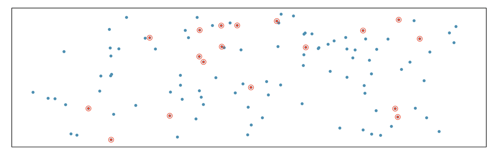
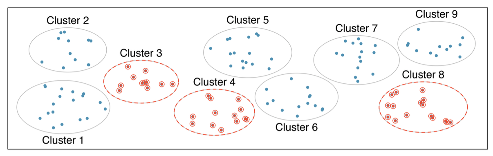
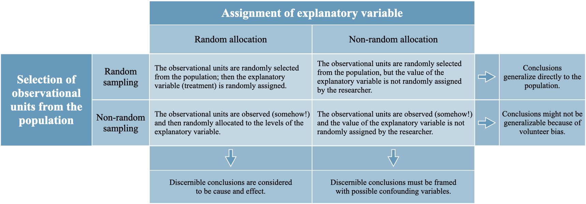
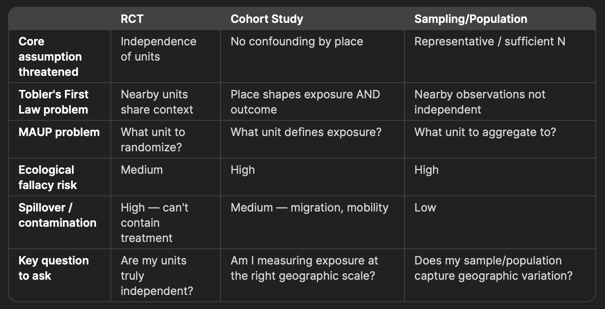

## Reading Check

::: incremental
1.  Why might a researcher choose **stratified sampling** instead of **simple random sampling**?

2.  What does random assignment accomplish in a **Randomized Control Trial** **(RCT)**?

3.  What is a **confounding variable**?

4.  What is one important difference between an **experiment** and an **observational study**?

5.  What is one difference between **stratified sampling** and **cluster sampling**
:::

## Simple Random Sampling

{fig-align="center"}

## Stratified Random Sampling

{fig-align="center"}

- [High variability across]{.underline} Strata, [low variability within]{.underline} stratum

## Cluster Sampling - single stage

{fig-align="center"}

- [High variability within]{.underline} Cluster [low variability within]{.underline} stratum

## Multistage cluster sampling

{fig-align="center"}

## Generalization and Inference

{fig-align="center"}

## RCTs: Geographic Considerations

### **What an RCT Assumes**

- Units are **independent**: what happens to one unit doesn't affect another

- **Random assignment** removes confounding

- Treatment and control groups are **comparable**

## RCTs: Geographic Considerations

- Observations nearby may **not be independent**

Tobler's First Law in action:

> ***"Everything is related to everything else, but near things are more related than distant things."***

- If you randomize **individuals** within a neighborhood, those individuals share air quality, noise, access to parks, social norms, food environments

- This means your **effective sample size is smaller than it appears**

- Standard statistical tests will be **overconfident** in your results

## RCTs: Geographic Considerations

**Problem 2: Spillover / Contamination Effects**

- A job training program in one neighborhood may attract businesses that benefit the neighboring *control* neighborhood

- A vaccination campaign reduces disease in the *unvaccinated* control group through **herd immunity**

- This is called **interference** or **SUTVA violation** (Stable Unit Treatment Value Assumption)

## RCTs: Geographic Considerations

**Problem 3: Places can be randomized, but they are randomized as clusters**

- Examples: schools, clinics, neighborhoods, counties

- Clusters may differ in history, infrastructure, demographics, and baseline outcomes

- Randomization helps create a comparison, but it does not make places identical

- **Cluster Randomized Control Trials** usually require *more clusters, larger samples, and attention to spillover and contamination*

## RCTs: Geographic Considerations

**Problem 4: What is the appropriate unit of randomization?**

- Individual, Household, Block, Neighborhood, County?
- The choice affects *spillover, statistical power, treatment implementation, unit of inference, generalizability*
- Geographic results may also change when researchers change *the scale of analysis*, or *the boundaries used*
- This is related to the **modifiable areal unit problem (MAUP)**

## Cohort Studies

### **What a Cohort Study Assumes**

- You follow a group of people over time

- You measure **exposure** and then **outcome**

- Differences in outcome are due to differences in exposure

## Cohort Studies

**Problem 1: Geographic Confounding**

- Where people **live** shapes almost everything about them:

  - Air and water quality, access to healthcare, food environment etc.

- These are called **place-based confounders** — they travel together and are very hard to separate

## Cohort Studies

**Problem 2: Residential Sorting (Selection Into Place)**

- People do not live randomly — they **sort themselves geographically** by:

  - Income, race and ethnicity, health, age etc.

- This means geographic exposure is **not randomly assigned**

  - Sicker people may live in poorer areas *because* they are sicker — or they may become sicker *because* they live there

- Cause and effect are deeply entangled

## Cohort Studies

**Problem 3: Mobility and Changing Exposure**

- Cohort studies follow people over time

- But people **move** and their geographic exposure changes

- A person exposed to industrial pollution for 5 years, then moving to clean air, has a complex exposure history

- This is a major source of **exposure misclassification**

## Cohort Studies

**Problem 4: The Ecological Fallacy**

- **Drawing conclusions about *individuals* from *group-level* geographic data**

- We often measure exposure at the **area level** (neighborhood poverty rate, county pollution average) but care about **individual outcomes**

- The relationship at one geographic scale does not transfer to another

- Related to ***Simpson's paradox***

## Summary

{fig-align="center"}
