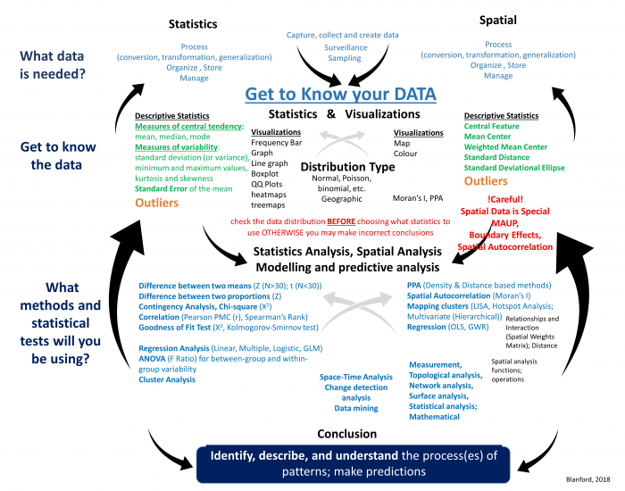

## Outline {.smaller}

-   Introduction
-   Measurement of Distance
    -   Great Circle, Euclidian, Manhattan
-   Measurement of Spatial Central Tendency
    -   (weighted) mean center
    -   (weighted) median center
-   Measurement of spatial variability
    -   (weighted) Standard distance
    -   Standard deviational ellipse
    -   Relative distance

## Descriptive Spatial Statistics

{fig-align="center"}

## Descriptive Spatial Statistics

::: columns
::: {.column width="60%"}
{fig-align="center" width="1605"}
:::

::: {.column width="40%"}
-   Where are these points generally located?
-   How are these points spread out from there general location
:::
:::

## Descriptive Spatial Statistics {.smaller}

::: columns
::: {.column width="60%"}
{fig-align="left" width="1605"}
:::

::: {.column width="40%"}
-   Analagous to traditional descriptive statistics
    -   Graphical presentation
    -   numerical summary of spatial data
-   Measures 2 important geographic concepts
    -   Spatial Central Tendency
    -   Spatial Variability
:::
:::

## Measures of Distance

-   Great Circle Distance

    -   Shortest distance 2 points on a globe

-   Euclidean Distance

    -   Shortest distance on a flat surface
    -   As the crow flies

{fig-align="center"}

## Measures of Distance

::: columns
::: {.column width="60%"}
{fig-align="center"}
:::

::: {.column width="40%"}
-   Manhattan Distance

    -   Travel restricted across horizontal and vertical dimensions

-   Minkowski Distance

    -   Compromise between euclidean and manhattan
    -   Distance of a curved arc connecting two points
:::
:::

## Measures of Distance

-   Network Distance

-   Other measures of distance

-   Social Distance

-   Travel Time

-   Absolute vs Relative Distance

## Mean Center (Spatial Mean)

-   Most commonly used measure for spatial central tendency
-   Average(mean) location of a set of points
    -   eg. (x1,y1), (x2,y2)........(xN, yN)

{fig-align="center"}

## Mean Center (Spatial Mean)

{fig-align="center"}

## Mean Center Application

{fig-align="center"}

## Limitations of Mean Center

-   Often used for 'event' data
-   Only considers location of points (x,y)
-   All points are equally important
-   main aim is to look at how points are distributed
-   point attributes are ignored
    -   Example - population density, number of deaths in household

## Weighted Mean Center

-   Mean Center Weighted by Attribute
-   Considers both the location and attributes

{fig-align="center"}

## Weighted Mean Center

{fig-align="center"}

## Application of Weighted Mean Center

{fig-align="center"}

## Limitations of Mean Centers

-   Sensitivity to outliers!
    -   Similar to traditional statistics

{fig-align="center"}

## Median Center

-   Robust to Spatial Outliers
    -   The sum of distance from median center to all points is minimized
-   Weighted Median Center
    -   Use attribute as a weight

{fig-align="center"}

## Applications of Median Center {.smaller}

::: incremental
-   Suppose that we want to build a food warehouse that is used to provide food to all shelters in a city, how to find the location for the warehouse?

-   What we want: when we deliver food to each shelter, the total distance the delivery vehicle traveled is minimized.

-   Some shelters have larger capacity and thus may need more food than others, in this case we may need more trips to these shelters.

    -   Use attribute as a weight

-   So we want a location that minimizes total travel distances considering different food demand of each shelter: weighted median center (shelter capacity as weight)
:::

## Standard Distance

-   Measures spatial dispersion of a set of points
-   Analogous to standard deviation in classical statistics
-   Square root of the average squared distance of points to the mean center

{fig-align="center"}

## Standard Distance

-   Measures spatial dispersion of a set of points
-   Analogous to standard deviation in classical statistics
-   Square root of the average squared distance of points to the mean center

{fig-align="center"}

## Standard Distance Calculation

{fig-align="center"}

## Weighted Standard Distance

-   Each point as a weight (Wi)
-   Use weighted mean center instead of mean center

{fig-align="center"}
## Standard Distance Application

{fig-align="center"}

## Standard Distance Application

-   Knowing how crimes are distributed may help police develop strategies for addressing the crime

    -   If crime distribution is compact, stationing a single car patrol the area may be enough
    -   If dispersed, having several police cars might be more effective

## Standard Deviational Ellipse

-   Similar to Standard Distance but also captures the *shape* of the distribution
-   central tendency, dispersion, and *directional trends*

](assets/sde_example.webp){fig-align="center"}

## Relative Distance

-   How to compared distances when study areas (A) are different

{fig-align="center"}

