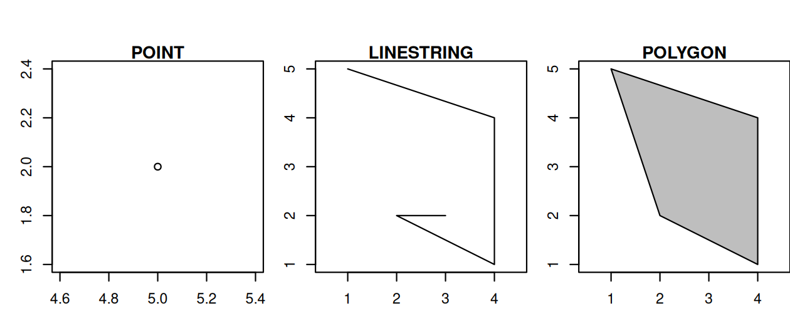
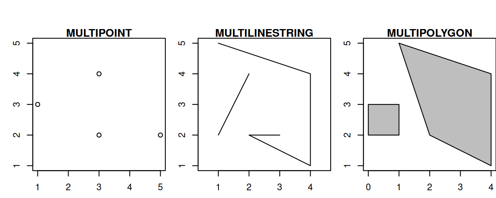
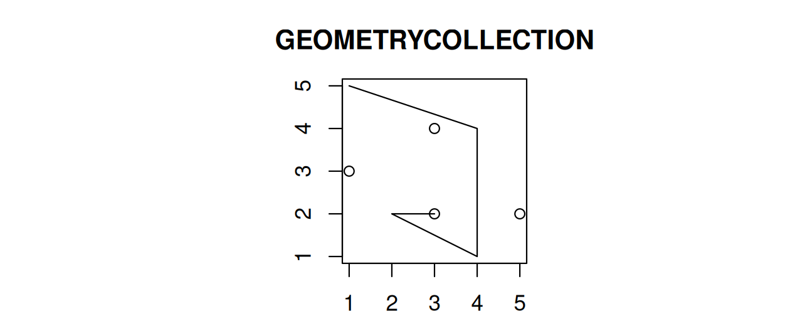
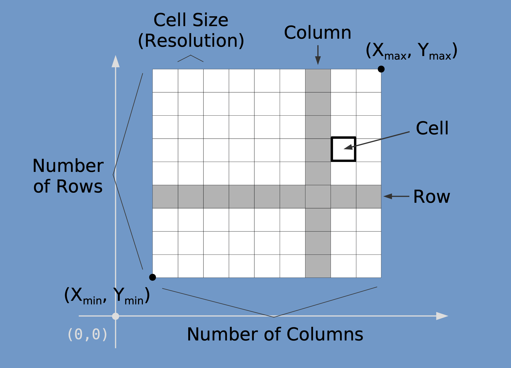
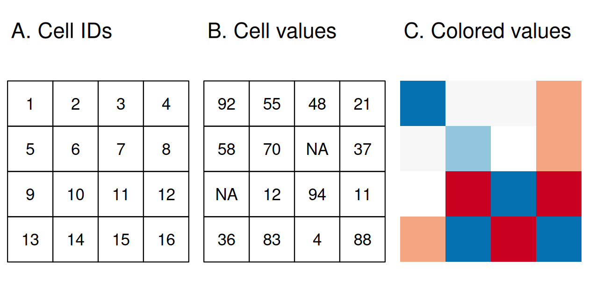
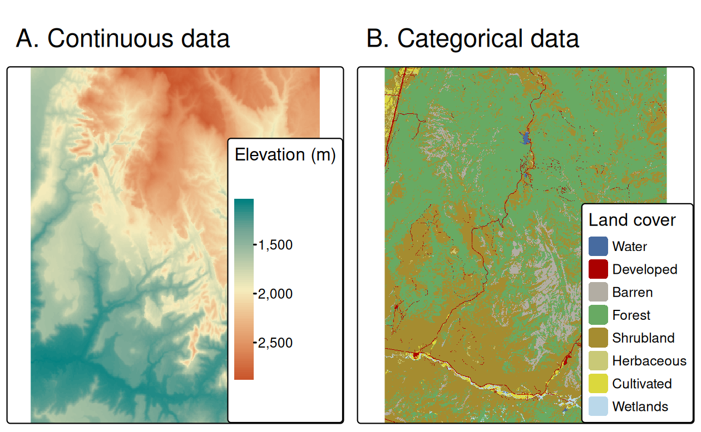

## Outline

-   Conceptual Models of Space
-   Geospatial Data Models
    -   Vector
    -   Raster
-   Attribute Data

## Conceptual Models of Space

-   [**Objects**]{.underline} present a view of the world in which the Earth surface is populated by a number discrete entities (e.g., houses, streets, lakes)

    -   Object types include points, lines, polygons, networks

-   [**Fields**]{.underline} present a view of the world in which Earth is a continuous surface that is characterized by a number of properties

    -   e.g., temperature, land use, soil pH

## Conceptual Models of Space

-   Important differences between object and field conceptual models

    -   In the object model, focus is on the “object” (which can have many attributes/variables)
    -   In the field model, focus is on the “attribute” (how does the attribute vary over space)
    -   In the object model, space between entities is “empty” No empty space in the field model

## Geospatial Data Models

-   We use spatial data models to describe the conceptual models for digital representation
    -   Vector (object)
        -   Spatial "features" (points, lines, polygons)
    -   Raster (field)
        -   Grid cells, where each cell is a single value

## Representing Geospatial Phenomena

::: incremental
-   Consider how you would represent the following
    -   Cases of robberies in Columbia
    -   Elevation across South Carolina
    -   Air pollution across Los Angeles
    -   Distribution of air pollution sensors across Los Angeles
    -   Average air pollution across each zip code in Los Angeles
:::

## Vector Data

{fig-align="center"}

## Vector Data

{fig-align="center"}

## Vector Data

{fig-align="center"}

## Raster Data

{fig-align="center"}

## Raster Data

{fig-align="center"}

## Raster Data

{fig-align="center"}
