## Today’s roadmap

We will use descriptive spatial statistics to answer three questions:

1.  How far apart are locations?
2.  Where is the geographic “center” of a pattern?
3.  How dispersed—and in which direction—is the pattern?

## Start with a spatial question

{fig-align="center"}

## Descriptive Spatial Statistics

::::: columns
::: {.column width="60%"}
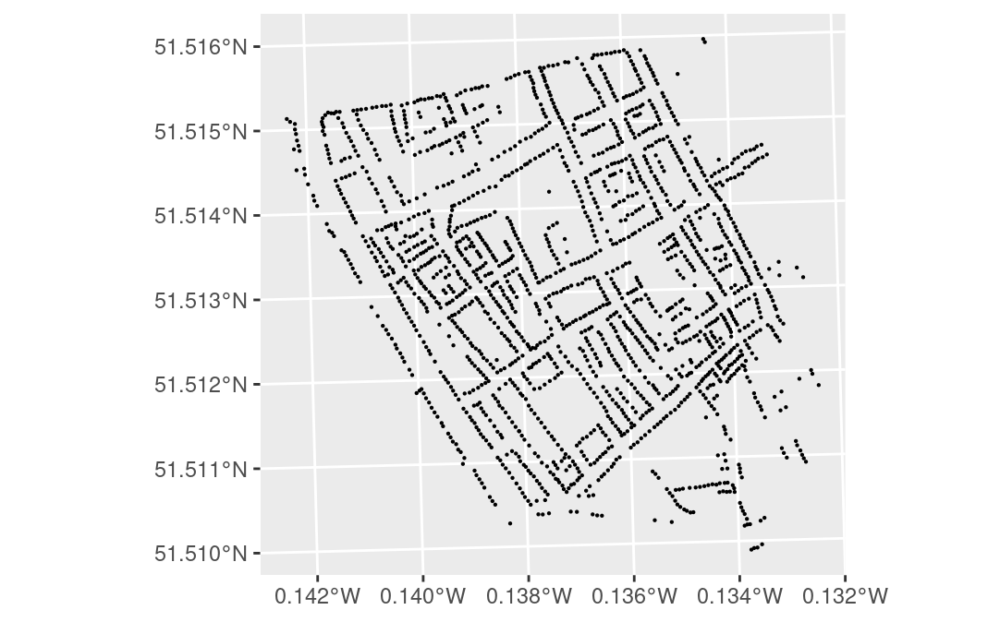{fig-align="center" width="1605"}
:::

::: {.column width="40%"}
Where is the typical location of these points, and how far do they spread from it?

Descriptive spatial statistics turn that visual judgment into a reproducible summary.
:::
:::::

## What do descriptive spatial statistics summarize? {.smaller}

::::: columns
::: {.column width="60%"}
{fig-align="left" width="1605"}
:::

::: {.column width="40%"}
Like descriptive statistics for a single variable, these methods combine maps with numerical summaries.

They focus on two geographic ideas:

- **Spatial central tendency:** the typical location of a distribution
- **Spatial variability:** the amount, shape, and direction of spread
:::
:::::

## Measures of Distance

**Great-circle distance** is the shortest route between two points on a globe.

**Euclidean distance** is the straight-line distance on a flat surface—“as the crow flies.”

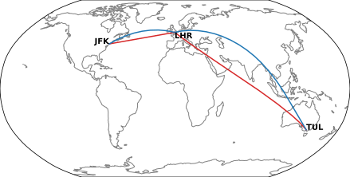{fig-align="center"}

## Measures of Distance: paths matter

::::: columns
::: {.column width="40%" height="50%"}
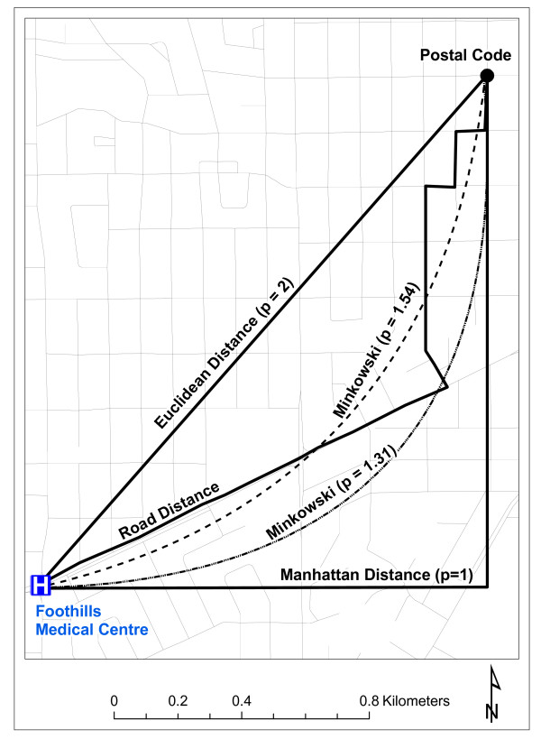{fig-align="center"}
:::

::: {.column width="40%"}
**Manhattan distance** follows perpendicular street-grid movements.

**Minkowski distance** is a family of measures that includes Euclidean and Manhattan distance as special cases. It lets us model travel that falls between those two extremes.
:::
:::::

## Choosing a distance measure

Choose the measure that matches the process, not merely the map.

For every spatial analysis, ask: *What kind of separation could actually affect the phenomenon?*

- **Network distance or travel time:** movement along roads, transit, or paths
- **Absolute distance:** physical units such as kilometers
- **Relative distance:** distance scaled to make patterns comparable across study areas
- **Social distance:** separation in social characteristics

## Mean Center (Spatial Mean)

The mean center is the average location of a set of points

- the mean of all x-coordinates and

- the mean of all y-coordinates

It is the most common measure of spatial central tendency.

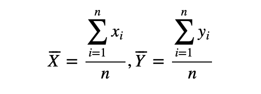{fig-align="center"}

## Mean Center (Spatial Mean)

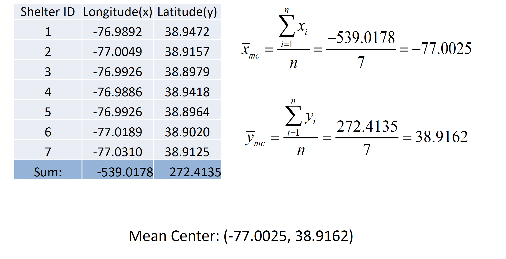{fig-align="center"}

## Mean Center Application

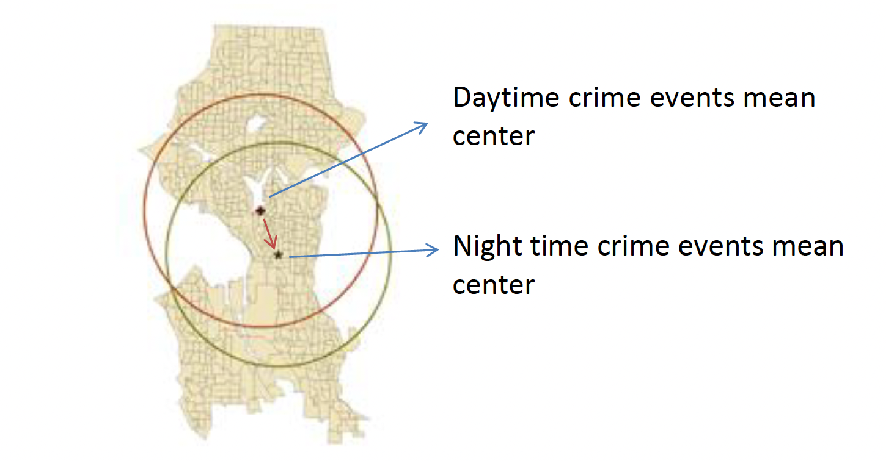{fig-align="center"}

## When is an ordinary mean center insufficient?

## When is an ordinary mean center insufficient?

- The ordinary mean center treats every point equally and uses only its coordinates.

- Appropriate for equally important events, such as reported incidents.

- Less appropriate when locations differ in magnitude—for example, population, sales, or households affected.

## Weighted Mean Center

A weighted mean center gives more influence to locations with larger attribute values.

Use it when both **where** something occurs and **how much** occurs there matter.

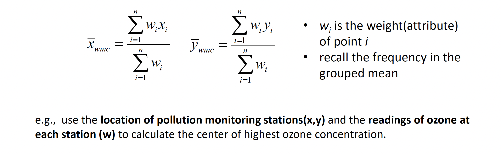{fig-align="center"}

## Weighted Mean Center

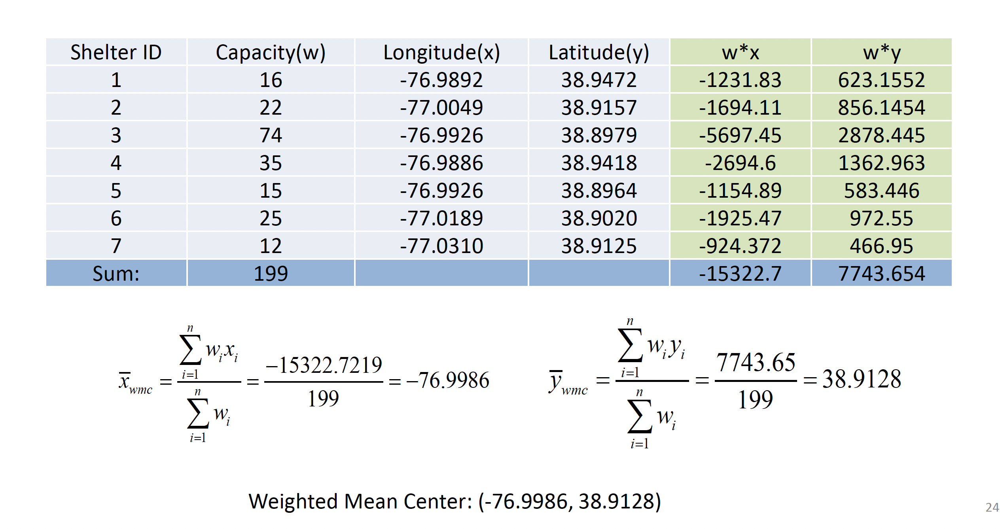{fig-align="center"}

## Application of Weighted Mean Center

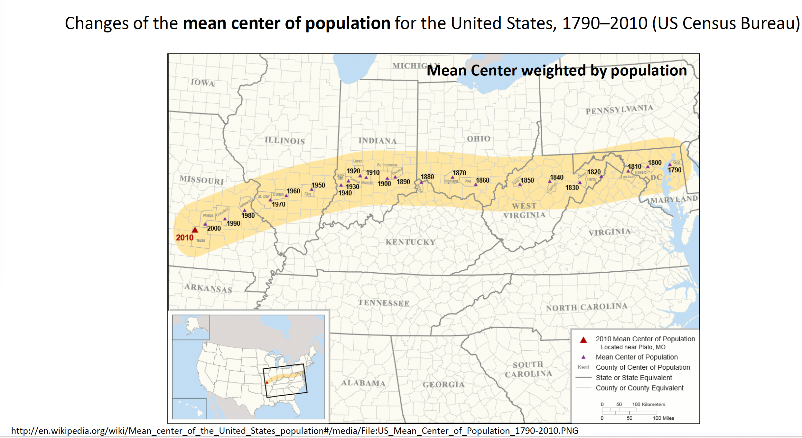{fig-align="center"}

## Limitation of Mean Centers

## Limitation of Mean Centers

Mean centers are sensitive to outliers: one distant location can pull the center away from the main cluster.

This is the same problem as the arithmetic mean in traditional statistics.

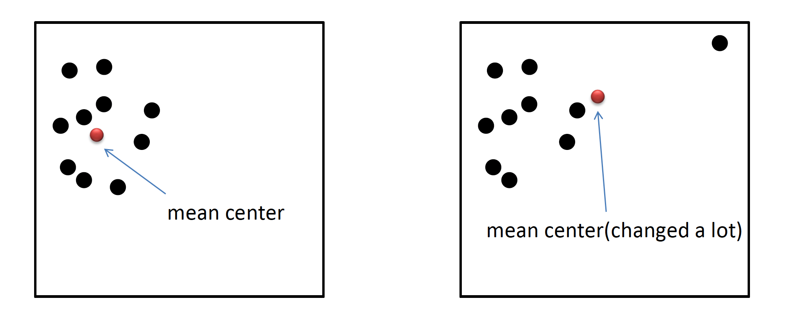{fig-align="center"}

## Median Center

The median center is more robust to spatial outliers than the mean center.

It is the location that **minimizes the total distance to all points**.

A **weighted median center** incorporates an attribute such as demand or population.

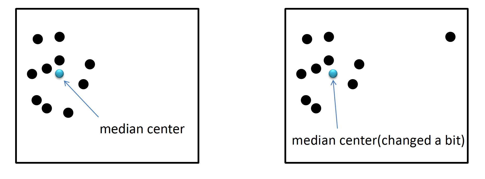{fig-align="center"}

## Example: Locating a food warehouse

Suppose a city supplies food to several shelters. What statistic is appropriate for the following:

- We want a warehouse location that minimizes total delivery distance

- We want a warehouse location that minimizes total number of deliveries, based on the capacity of different shelters

## Standard Distance

Standard distance measures the dispersion of a set of points around its mean center.

It is analogous to standard deviation in classical statistics: the square root of the average squared distance from each point to the mean center.

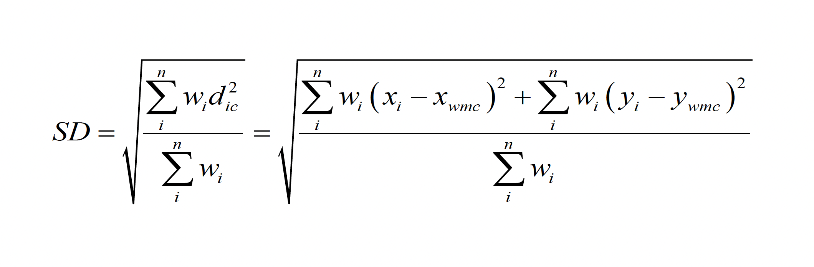{fig-align="center"}

## Standard Distance Calculation

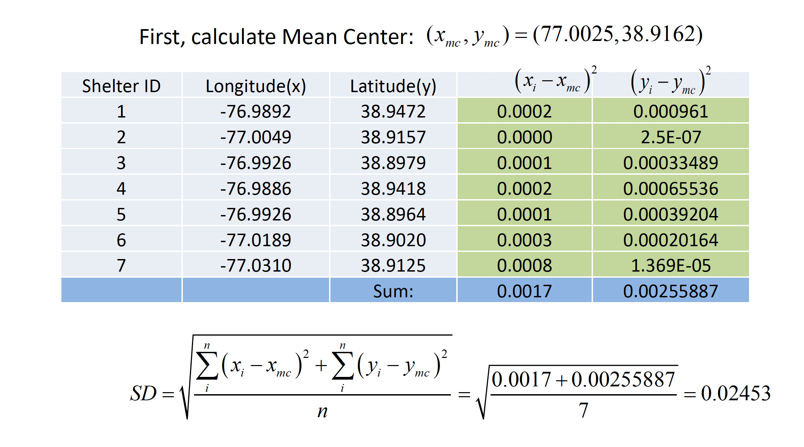{fig-align="center"}

## Weighted Standard Distance

When points vary in importance, weight each point by its attribute value and calculate spread around the weighted mean center.

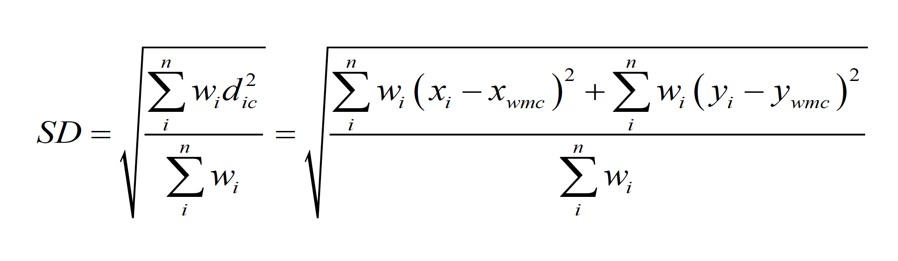{fig-align="center"}

## Standard Distance Application

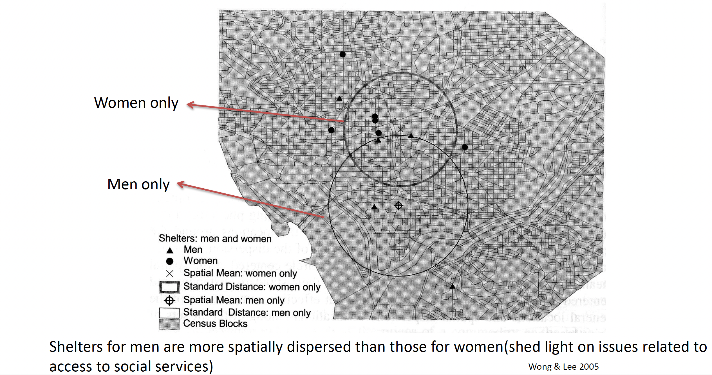{fig-align="center"}

## Standard Distance Application

Knowing whether crime locations are compact or dispersed can inform patrol allocation.

- For a compact pattern, one patrol area may cover much of the activity. For a dispersed pattern, several patrol areas may be more appropriate.

::: callout-caution
This is a descriptive summary, not evidence of causes or proof that a specific intervention will work.
:::

## Standard Deviational Ellipse

](assets/sde_example.webp){fig-align="center"}

## Standard Deviational Ellipse

- Standard distance describes overall spread.

- A standard deviational ellipse also describes the **shape** and **direction** of that spread.

  - Summarizes central tendency, dispersion, and directional trend—for example, whether events are stretched along a river, road corridor, or coast.

## Relative Distance

How can we compare distances across study areas of different sizes?

Relative distance scales a distance measure by a reference distance or study-area size. It helps distinguish a large distance in a large region from a large distance in a compact region.

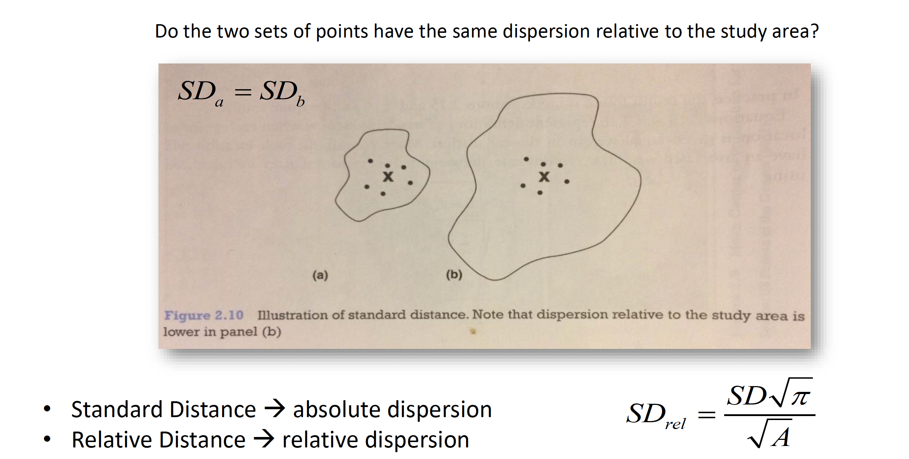{fig-align="center"}

## Takeaway

Descriptive spatial statistics summarize a pattern before we attempt to explain it.

- Choose a distance measure that reflects the process.
- Use mean or median centers to describe location.
- Use standard distance and ellipses to describe spread, shape, and direction.
