```{r}
library(tidyverse)
library(readr)
```


## Outline

-   Why visualize our data

    -   Are Descriptive Statistics Enough?

-   Linking quantitative data types to visualization

-   Data Visualization in action: (some) Do's and Dont's

## Why Visualize our data

-   Lab 4 exercise

##

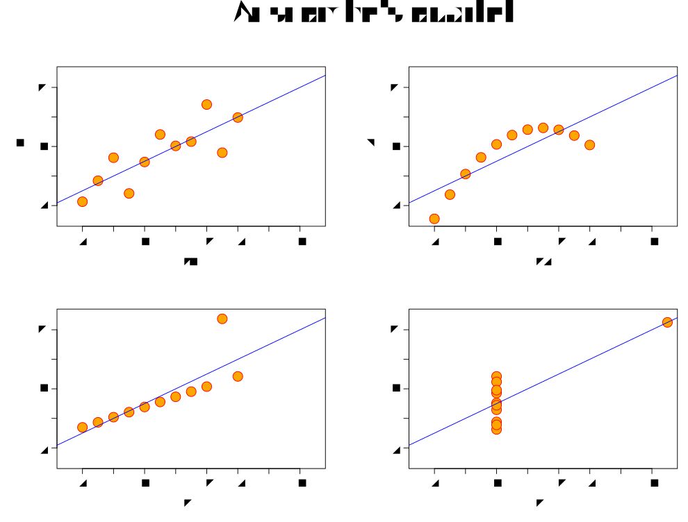{fig-align="center"}

## What exactly do you want to show

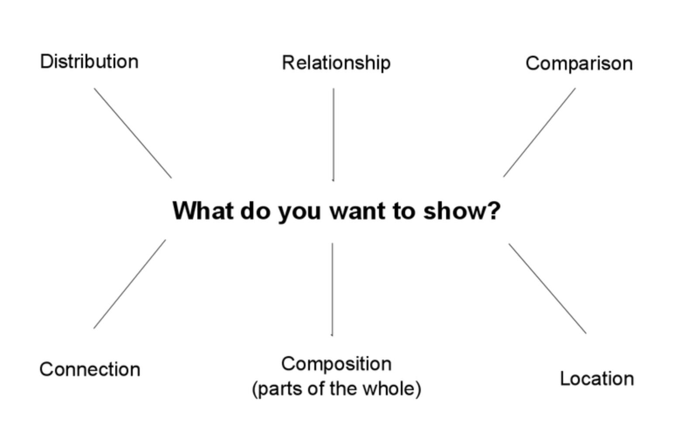{fig-align="center"}

## What kind of data/variable do you have?

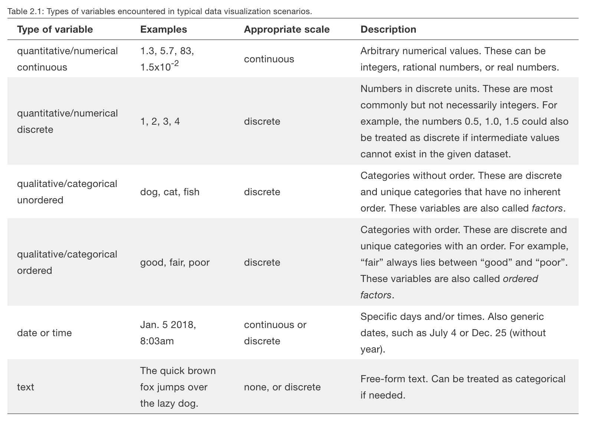{fig-align="center"}

## Distribution

-   What is the composition of my variable?

    - Are values concentrated/spread out
    - Are there any breaks/ outliers
    - Influences the questions you want to ask/ story you want to tell
    
## Distribution

```{r}

nc_wide <- read_rds("data/nc_wide.rds")
nc_tidy1 <- read_rds("data/nc_tidy1.rds")

nc_wide %>%
  ggplot(aes(x = med_hh_income)) + geom_histogram(col = "white",
                                                  binwidth = 10000) +
  theme_bw()

```

## Distribution

-   Continuous Variable, multiple categories

```{r}
nc_tidy1 %>% filter(race %in% c("white","black")) %>%
  ggplot(aes(x = race_pct, fill = race)) +
  geom_histogram(binwidth = 5 ,col = "white",
                 alpha = 0.3,position = "identity") +
  scale_x_continuous(breaks = seq(0, 100, 5))+
  theme_bw()
```

## Distribution

-   Continuous Variable, multiple categories
-   Density Plot

```{r}
nc_tidy1 %>% filter(race %in% c("white","black")) %>% 
  ggplot(aes(x = race_pct, fill = race)) + 
  geom_density(col = "white",
                 alpha = 0.3,position = "identity") + 
  scale_x_continuous(breaks = seq(0, 100, 5))+
  theme_bw()
```


## Distribution

- Categorical variable

```{r}
nc_wide %>%
  ggplot() + geom_bar(aes(x = white_majority, fill = white_majority)) +
  theme_bw()
```

## Relationship

-   Focus on co-variation

    - How do x and y vary together
    - Is there a trend?
    - *Correlation is not equal to Causation*
    
## Relationship

- Continuous variable, categorical variable
```{r}
nc_tidy1 %>%
  ggplot(aes(x = white_majority,y=med_hh_income)) + 
  geom_boxplot()  +
  theme_minimal()
```

## Relationship

- 2 continuous variables
```{r}
nc_tidy1 %>% filter(race %in% c("black","white")) %>%
  ggplot(aes(x = race_pct,y=med_hh_income)) + 
  geom_point()  + geom_smooth() + facet_wrap(~race) +
  theme_minimal()
```

## Comparison

-   Focus on spotting differences

    - Differences across categories
    - Differences across time
    - Differences across units

## Comparison
-   Differences across units

```{r}
nc_wide %>% mutate(name = name %>% str_replace(" County, North Carolina","")) %>%
  ggplot(aes(y = reorder(name,med_hh_income),x=med_hh_income)) + 
  geom_point(color = "maroon") + labs(x = "Median Household Income",
                      y = "County Names",
                      title = "Median HH Income by County") +
  theme_minimal() + theme(axis.text.y = element_text(size = 6)) +
  ggsave("sample_plot.pdf")
```

## Composition

-   Focus on parts of a whole

    - Focus on relative percentages
    - Generally not on counts
    
## Composition

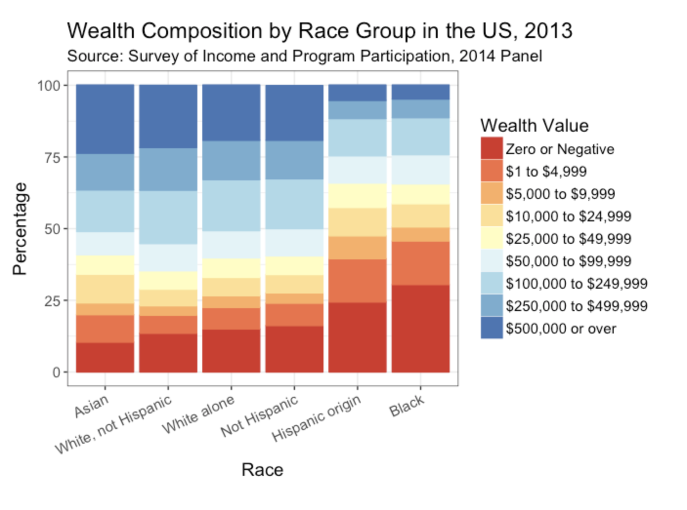{fig-align="center"}

## Composition

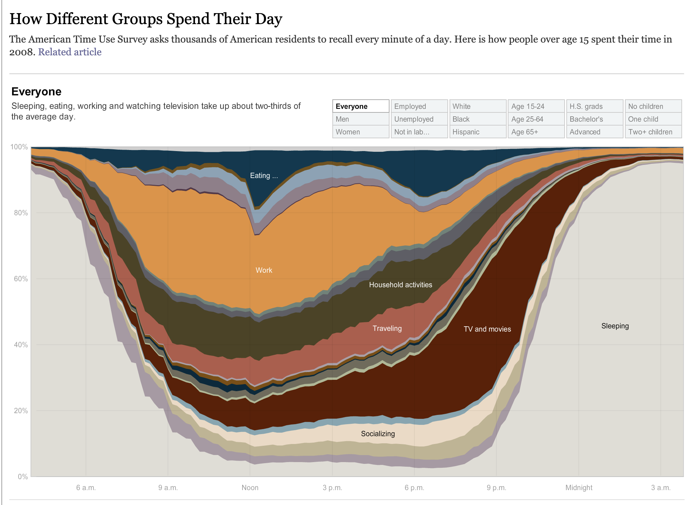{fig-align="center"}

## Visualization Dont's

- Bad Taste

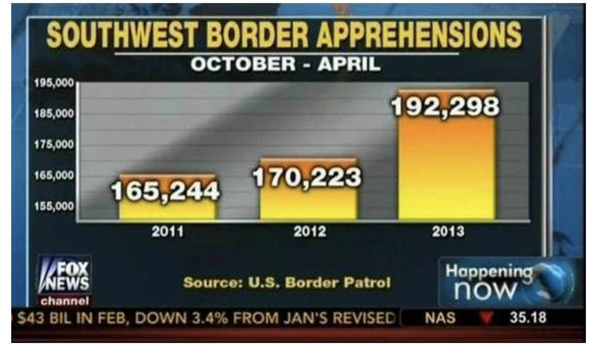{fig-align="center"}

## What may be wrong with this visualization

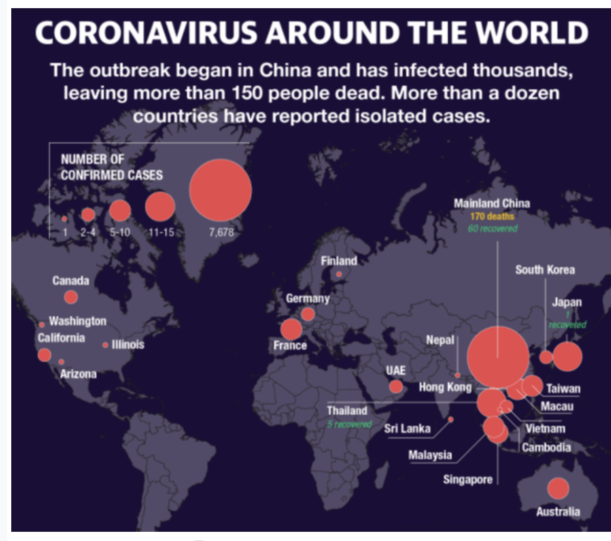{fig-align="center"}

## What about this?

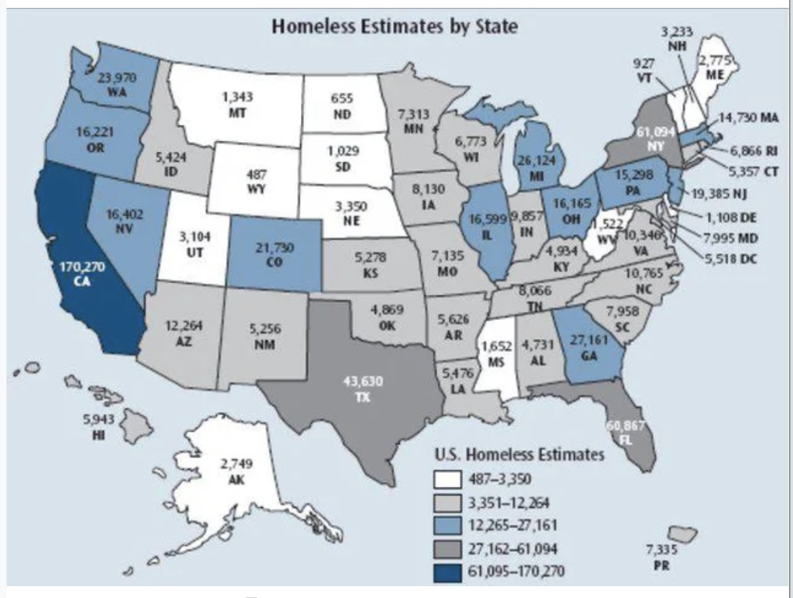{fig-align="center"}

## Bad Perception

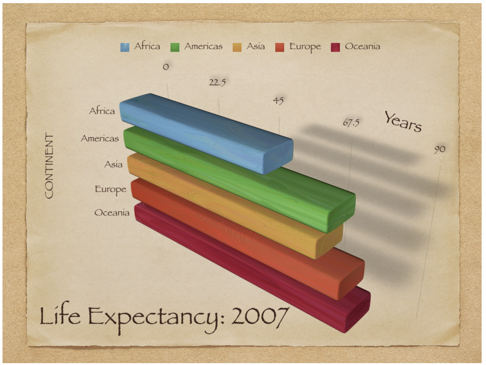{fig-align="center"}

## Bad Perception

-   Pick your battles or Risk Sensory Overload

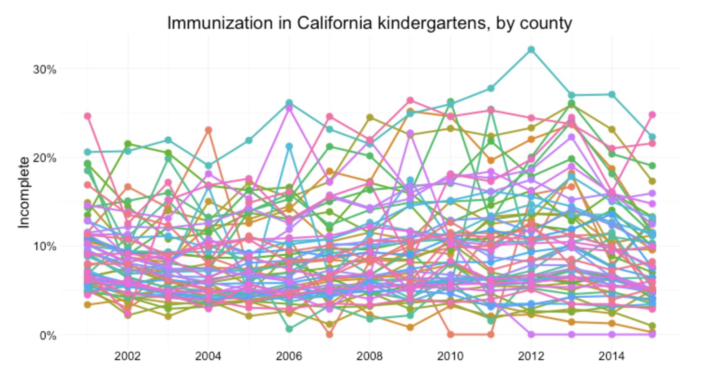{fig-align="center"}

##

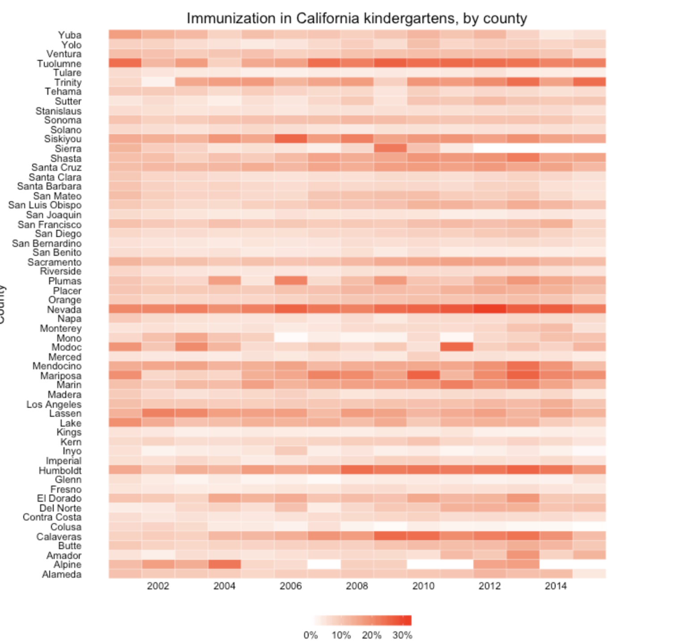{fig-align="center"}

## Guided Class Discussion