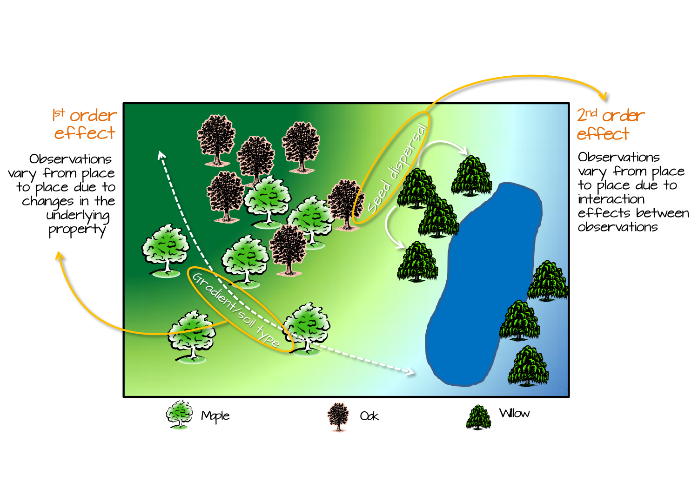

## Module Overview {.smaller}

### Overview

- Introduction to Exploratory Spatial Data Analysis (ESDA)
- Patterns vs Processes
- First-order vs. Second-order Effects
- Point Pattern Analysis
  - Nearest Neighbor Analysis

------------------------------------------------------------------------

## What is Exploratory Spatial Data Analysis?

{fig-align="center"}

------------------------------------------------------------------------

## What is Exploratory Spatial Data Analysis? {.smaller}

```{=html}
<style>
.neat-table {
  font-size: 0.8em;
  width: 100%;
  border-collapse: collapse;
}
.neat-table th, .neat-table td {
  border: 2px solid #666;
  padding: 10px;
  vertical-align: top;
}
.neat-table th {
  background-color: #003366;
  color: white;
}
</style>
```

| Core Concepts | Key Questions |
|------------------------------------------|-----------------------------|
| **Exploratory**: Initial investigation of spatial data | Is there spatial pattern? |
| **Visual**: Maps, plots, graphs | Where are the patterns? |
| **Statistical**: Quantitative measures | Are patterns clustered or dispersed? |
| **Hypothesis-generating**: Not confirmatory | Are patterns random or systematic? |

::: {.callout-important .fragment data-fragment-index="9"}
ESDA reveals structure before formal modeling
:::

------------------------------------------------------------------------

## Patterns vs. Processes {.smaller}

::::: columns
::: {.column width="50%"}
### Pattern

- **What we observe**
- The spatial arrangement
- Descriptive
- Examples:
  - Clustered disease cases
  - Dispersed fire stations
  - Random plant distribution
:::

::: {.column width="50%"}
### Process

- **Why it exists**
- The generating mechanism
- Explanatory
- Examples:
  - Disease transmission
  - Planning optimization
  - Seed dispersal mechanisms
:::
:::::

------------------------------------------------------------------------

## Patterns vs. Processes {.nonincremental}

::: callout-warning
## Critical Distinction

**Multiple processes can produce similar patterns!**\
**Same process can produce different patterns!**
:::

::: callout-note
We **analyze** patterns to **infer** processes\
Different underlying mechanisms can create similar-looking spatial arrangements
:::

------------------------------------------------------------------------

## Pattern-Process Examples {.smaller}

### Urban Crime Distribution

**Observed Pattern**: Crime clustered in certain neighborhoods

**Possible Processes**:

1.  **Social disorganization** (community characteristics)
2.  **Routine activity theory** (opportunity structures)
3.  **Broken windows** (environmental cues)
4.  **Repeat victimization** (contagion effects)

::: {.callout-note .fragment}
Same pattern, different theoretical explanations!\
Need theory + statistical analysis + domain knowledge
:::

------------------------------------------------------------------------

## Processes: First-Order vs. Second-Order Effects

```{r}
#| echo: false
#| fig-width: 12
#| fig-height: 4
set.seed(456)
library(ggplot2)
library(gridExtra)
# First order - gradient
x_grad <- runif(200, 0, 10)
y_grad <- runif(200, 0, 10)
# More points in upper right
prob_grad <- x_grad * y_grad
keep_grad <- runif(200) < (prob_grad / max(prob_grad))
df_first <- data.frame(x = x_grad[keep_grad], y = y_grad[keep_grad])

# Second order - clusters
n_clusters <- 4
centers <- data.frame(x = c(2, 8, 3, 7), y = c(2, 8, 7, 3))
points_per_cluster <- 30
df_second <- data.frame()
for(i in 1:n_clusters) {
  cluster_points <- data.frame(
    x = rnorm(points_per_cluster, centers$x[i], 0.5),
    y = rnorm(points_per_cluster, centers$y[i], 0.5)
  )
  df_second <- rbind(df_second, cluster_points)
}

# Random for comparison
df_random <- data.frame(x = runif(120, 0, 10), y = runif(120, 0, 10))

p1 <- ggplot(df_random, aes(x, y)) +
  geom_point(size = 2, alpha = 0.6, color = "darkgreen") +
  theme_minimal() +
  ggtitle("Random (No Effects)") +
  xlim(0, 10) + ylim(0, 10)

p2 <- ggplot(df_first, aes(x, y)) +
  geom_point(size = 2, alpha = 0.6, color = "blue") +
  theme_minimal() +
  ggtitle("First-Order (Density Gradient)") +
  xlim(0, 10) + ylim(0, 10)

p3 <- ggplot(df_second, aes(x, y)) +
  geom_point(size = 2, alpha = 0.6, color = "red") +
  theme_minimal() +
  ggtitle("Second-Order (Clustering)") +
  xlim(0, 10) + ylim(0, 10)

grid.arrange(p1, p2, p3, ncol = 3)
```

------------------------------------------------------------------------

## First & Second Order Effects {.smaller}

### First-Order Effects (Intensity/Density)

- **Definition**: Variation in the *average* number of events across space
- **What it captures**: Spatial trend, large-scale variation
- **Example**: More disease cases in densely populated areas

### Second-Order Effects (Dependence/Interaction)

- **Definition**: Correlation between events at *different locations*
- **What it captures**: Local clustering, spatial dependence
- **Example**: Disease cases clustered due to contagion (beyond population density)

------------------------------------------------------------------------

## First-Order vs. Second-Order Effects {.nonincremental}

- First-Order Effects (Intensity/Density)

- Second-Order Effects (Dependence/Interaction)

::: callout-tip
## Why This Matters {.fragmented}

Different analysis methods target different effects!\
Understanding this helps you choose the right tool.
:::

------------------------------------------------------------------------

## First-Order Effects in Detail {.smaller}

### Characteristics

- Large-scale spatial trends
- "Density surface" varies across study area
- Related to environmental/contextual factors

### Examples

- Population density → disease incidence
- Elevation → vegetation types\
- Distance from CBD → housing prices

------------------------------------------------------------------------

## Second-Order Effects in Detail {.smaller}

### Characteristics

- **Spatial dependence**: "Everything is related, but nearby things more so" (Tobler's Law)
- Local clustering beyond overall density
- Point-to-point interactions

### Examples

- Contagious disease spread (beyond density)
- Tree competition effects
- Social influence on voting patterns

------------------------------------------------------------------------

## Why the Distinction Matters {.smaller}

::: callout-important
## Interpretation Challenge

A clustered pattern could result from:

1.  **First-order effects only**: Varying density due to environmental factors
2.  **Second-order effects only**: Uniform density but local interactions
3.  **Both**: Density variation AND clustering within high-density areas
:::

------------------------------------------------------------------------

## Why the Distinction Matters {.smaller}

{fig-align="center"}

------------------------------------------------------------------------

## Point Pattern Analysis {.smaller}

### What Are Point Patterns?

**Definition**: Spatial arrangement of discrete events/objects represented as points

**Characteristics**: - **Location**: $(x, y)$ coordinates - **Marked**: May have attributes (size, type, time) - **Study area**: Defined region of interest

### Examples

- Disease cases (lat/lon of residences)
- Tree locations in a forest
- Crime incidents
- Fire/emergency service facilities

------------------------------------------------------------------------

## Goals of Point Pattern Analysis

### Primary Objectives

1.  **Describe** the spatial arrangement
    - Is it clustered, dispersed, or random?
2.  **Quantify** the degree of clustering/dispersion
    - How clustered/dispersed?
3.  **Test** against theoretical distributions
    - Is the pattern significantly different from random?
4.  **Infer** underlying processes
    - What mechanism generated this pattern?

------------------------------------------------------------------------

## Complete Spatial Randomness (CSR)

```{r}
#| echo: false
#| fig-width: 12
#| fig-height: 3.5
set.seed(789)

# Clustered
df_clust <- data.frame()
for(i in 1:5) {
  center <- c(runif(1, 1, 9), runif(1, 1, 9))
  pts <- data.frame(
    x = rnorm(20, center[1], 0.6),
    y = rnorm(20, center[2], 0.6)
  )
  df_clust <- rbind(df_clust, pts)
}

# Random
df_rand <- data.frame(x = runif(100, 0, 10), y = runif(100, 0, 10))

# Dispersed (use regular grid with small jitter)
grid_pts <- expand.grid(x = seq(1, 9, length.out = 10), 
                        y = seq(1, 9, length.out = 10))
df_disp <- data.frame(
  x = grid_pts$x + rnorm(100, 0, 0.2),
  y = grid_pts$y + rnorm(100, 0, 0.2)
)

p1 <- ggplot(df_clust, aes(x, y)) +
  geom_point(size = 2.5, color = "red", alpha = 0.6) +
  theme_minimal() + ggtitle("CLUSTERED") +
  theme(plot.title = element_text(face = "bold", hjust = 0.5)) +
  xlim(0, 10) + ylim(0, 10)

p2 <- ggplot(df_rand, aes(x, y)) +
  geom_point(size = 2.5, color = "blue", alpha = 0.6) +
  theme_minimal() + ggtitle("RANDOM (CSR)") +
  theme(plot.title = element_text(face = "bold", hjust = 0.5)) +
  xlim(0, 10) + ylim(0, 10)

p3 <- ggplot(df_disp, aes(x, y)) +
  geom_point(size = 2.5, color = "darkgreen", alpha = 0.6) +
  theme_minimal() + ggtitle("DISPERSED") +
  theme(plot.title = element_text(face = "bold", hjust = 0.5)) +
  xlim(0, 10) + ylim(0, 10)

grid.arrange(p1, p2, p3, ncol = 3)
```

------------------------------------------------------------------------

## Nearest Neighbor Analysis (NNA)

### Concept

**Measures the spacing between points**

- For each point, find distance to its nearest neighbor
- Calculate mean nearest neighbor distance ($\overline{NND}$)
- Compare to expected distance under CSR

------------------------------------------------------------------------

## Nearest Neighbor Analysis (NNA)

### Learning Check

- In nearest neighbor analysis, what does an R value of **0**, **1**, and **2.149** represent? Briefly explain what an R value below 1 versus above 1 suggests about a point pattern

- Explain one important way that **nearest neighbor analysis** and **quadrat analysis** differ in how they characterize a point pattern. In your answer, identify the **main statistic** used in each approach.

------------------------------------------------------------------------

## NNA: The Mathematics {.smaller}

### Observed Mean Nearest Neighbor Distance

$$\overline{NND} = \frac{\sum NND}{n}$$

where $n$ = number of points

### Expected Distance Under CSR

$$\overline{NND}_E = \frac{1}{2\sqrt{Density}} = \frac{1}{2\sqrt{n/A}}$$

where:\
- $n$ = number of points\
- $A$ = area of study region\
- Density = $n/A$ (points per unit area)

------------------------------------------------------------------------

## NNA: R-Statistic {.smaller}

### Standardized Nearest Neighbor Index

$$R = \frac{\overline{NND}}{\overline{NND}_E}$$

### Interpretation

| R Value     | Pattern Type           | Interpretation                   |
|-------------|------------------------|----------------------------------|
| $R = 0$     | **Maximum clustering** | All points at same location      |
| $0 < R < 1$ | **Clustered**          | Points closer than random        |
| $R = 1$     | **Random (CSR)**       | Points follow CSR                |
| $R > 1$     | **Dispersed**          | Points farther apart than random |
| $R = 2.149$ | **Maximum dispersion** | Perfect hexagonal spacing        |

------------------------------------------------------------------------

## NNA: Statistical Significance

### Decision Rule

- If p-value \< 0.05, reject CSR, and if
  - R \> 1: significantly dispersed
  - R \< 1: significantly clustered
- If p-value \>= 0.05, you cannot reject CSR even if R is not 0.

------------------------------------------------------------------------

## NNA: Worked Example from Reading {.smaller}

**Toronto Community Services** (Police, Fire, Elementary Schools, Voting)

| Facility | n   | Density | $\overline{NND}$ | $\overline{NND}_E$ | R    | Z      | p-value |
|---------|---------|---------|---------|---------|---------|---------|---------|
| Police   | 20  | 0.0312  | 2.08             | 2.83               | 1.28 | 2.42   | 0.0153  |
| Fire     | 20  | 0.0312  | 2.08             | 2.83               | 1.28 | 2.42   | 0.0153  |
| Schools  | 20  | 0.7308  | 0.59             | \-                 | 0.84 | -12.23 | 0.0000  |
| Voting   | 20  | 24.4351 | 0.27             | \-                 | 0.84 | \-     | 0.0153  |

### Interpretations

- **Police & Fire**: Dispersed (planned spacing)
- **Schools**: Clustered (population density)
- **Voting**: Highly clustered

------------------------------------------------------------------------

## Nearest Neighbor Analysis (NNA)

### Key Advantage

- Simple to calculate and interpret
- Sensitive to second-order clustering/dispersion

### Limitation

- Reduces all spatial information to a single number
- Sensitive to boundary effects
- Only uses nearest neighbor (ignores other distances)

------------------------------------------------------------------------

## When to Use NNA {.smaller}

::::: columns
::: {.column width="50%"}
### Appropriate Situations ✓

- Relatively homogeneous study area
- Interest in overall spacing pattern
- Quick exploratory analysis
- Second-order effects (clustering)
:::

::: {.column width="50%"}
### Less Appropriate ✗

- Strong first-order effects (use quadrat)
- Multiple scales of clustering
- Need to identify cluster locations
- Very irregular boundaries
:::
:::::

::: callout-tip
**Best Practice**: Use NNA in combination with other methods (e.g., quadrat analysis, visual inspection) 
:::

------------------------------------------------------------------------

## Summary {.smaller}

### Key Concepts Covered

1.  **ESDA Framework**
    - Exploratory approach to spatial data
2.  **Patterns vs. Processes**
    - Observable vs. generative mechanisms
3.  **First vs. Second-Order Effects**
    - Density variation vs. spatial dependence
4.  **Point Pattern Analysis Introduction**
    - Complete Spatial Randomness (CSR)
5.  **Nearest Neighbor Analysis**
    - Measurement, interpretation, significance testing

------------------------------------------------------------------------

## Before Next Class {.smaller}

### Required Reading

- Review Lembo reading
- Focus on examples and interpretation

### Think About

- What spatial patterns exist in your research area?
- Are they first-order or second-order effects?
- What processes might generate these patterns?

### Next Lecture

- Quadrat Analysis, K function
- Comparing approaches
- Practical lab
