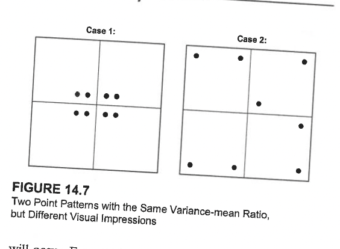

## Recap {.smaller}

::::: columns
::: {.column width="50%"}
### Conceptual Foundations

- **ESDA**: Exploratory spatial data analysis
- **Pattern vs. Process**: Observable vs. mechanism
- **First-order**: Density/intensity variation
- **Second-order**: Spatial dependence
- **CSR**: Complete Spatial Randomness baseline
:::

::: {.column width="50%"}
### Nearest Neighbor Analysis

- Measures point **spacing**
- Mean nearest neighbor distance
- R-statistic: $\overline{NND} / \overline{NND}_E$
- Sensitive to **second-order effects**
- Good for overall pattern assessment
:::
:::::

------------------------------------------------------------------------

## Learning Check

- **Interpreting VMR:** A quadrat analysis produces a variance-to-mean ratio (VMR) of **2.4**. What does this value suggest about the spatial point pattern? What VMR values would you **expect for random** and **dispersed patterns**?

- **Comparing quadrat analysis with ANN:** A point pattern has a V**MR of 2.4**, but its average nearest neighbor ratio is (**R = 1.02**) and is not statistically significant. Interpret these results and explain why quadrat analysis and ANN might produce different conclusions for the same point pattern.

------------------------------------------------------------------------

## Today's Focus

**Quadrat Analysis** - A complementary approach focusing on **density variation**

### Core Concept

**Divide study area into cells (quadrats) and count points in each cell**

### What It Measures

- **Variability in cell frequencies** (not spacing)
- Primarily **first-order effects** (density variation)
- Pattern of points across the study area

------------------------------------------------------------------------

## Quadrat Analysis

### Key Difference from NNA

- NNA: Point-to-point distances (spacing)
- Quadrat: Point counts per area unit (density)

::: callout-note
Quadrat analysis is analogous to a **frequency distribution** for spatial data
:::

------------------------------------------------------------------------

## Quadrat Analysis: Visual Concept

```{r}
#| echo: false
#| fig-width: 12
#| fig-height: 5
set.seed(101)

library(ggplot2)
library(gridExtra)
# Create three patterns
# Clustered
centers_c <- data.frame(x = c(2, 8, 2, 8), y = c(2, 2, 8, 8))
df_c <- data.frame()
for(i in 1:4) {
  pts <- data.frame(
    x = rnorm(15, centers_c$x[i], 0.8),
    y = rnorm(15, centers_c$y[i], 0.8)
  )
  df_c <- rbind(df_c, pts)
}

# Random
df_r <- data.frame(x = runif(60, 0, 10), y = runif(60, 0, 10))

# Dispersed
grid_base <- expand.grid(x = seq(0.5, 9.5, length.out = 8),
                         y = seq(0.5, 9.5, length.out = 8))
df_d <- data.frame(
  x = grid_base$x + rnorm(64, 0, 0.15),
  y = grid_base$y + rnorm(64, 0, 0.15)
)

# Quadrat grid overlay
quadrat_lines <- data.frame(
  x = rep(seq(0, 10, 2.5), each = 2),
  y = rep(c(0, 10), 5),
  group = rep(1:5, each = 2)
)
quadrat_lines_v <- data.frame(
  x = rep(c(0, 10), 5),
  y = rep(seq(0, 10, 2.5), each = 2),
  group = rep(6:10, each = 2)
)

p1 <- ggplot(df_c, aes(x, y)) +
  geom_point(size = 2, color = "red", alpha = 0.6) +
  geom_line(data = quadrat_lines, aes(x, y, group = group), 
            linewidth = 0.8, alpha = 0.5) +
  geom_line(data = quadrat_lines_v, aes(x, y, group = group), 
            linewidth = 0.8, alpha = 0.5) +
  annotate("text", x = 1.25, y = 8.75, label = "15", size = 5, color = "blue") +
  annotate("text", x = 3.75, y = 8.75, label = "2", size = 5, color = "blue") +
  annotate("text", x = 1.25, y = 1.25, label = "14", size = 5, color = "blue") +
  theme_minimal() + ggtitle("Clustered: High Variance") +
  xlim(0, 10) + ylim(0, 10)

p2 <- ggplot(df_r, aes(x, y)) +
  geom_point(size = 2, color = "blue", alpha = 0.6) +
  geom_line(data = quadrat_lines, aes(x, y, group = group), 
            linewidth = 0.8, alpha = 0.5) +
  geom_line(data = quadrat_lines_v, aes(x, y, group = group), 
            linewidth = 0.8, alpha = 0.5) +
  annotate("text", x = 1.25, y = 8.75, label = "4", size = 5, color = "blue") +
  annotate("text", x = 3.75, y = 8.75, label = "5", size = 5, color = "blue") +
  annotate("text", x = 1.25, y = 1.25, label = "3", size = 5, color = "blue") +
  theme_minimal() + ggtitle("Random: Moderate Variance") +
  xlim(0, 10) + ylim(0, 10)

grid.arrange(p1, p2, ncol = 2)
```

**Insight**: Clustered patterns → high variance in cell counts\
Random patterns → moderate variance (Poisson)

------------------------------------------------------------------------

## Variance-Mean Ratio (VMR) {.smaller}

### The Key Statistic

$$VMR = \frac{VAR}{MEAN} = \frac{s^2}{\bar{X}}$$

where: - $s^2$ = variance of cell frequencies - $\bar{X}$ = mean cell frequency

### Theoretical Expectations

| Pattern          | VMR       | Interpretation                            |
|------------------|-----------|-------------------------------------------|
| **Clustered**    | $VMR > 1$ | Variance exceeds mean (overdispersion)    |
| **Random (CSR)** | $VMR = 1$ | Poisson distribution                      |
| **Dispersed**    | $VMR < 1$ | Variance less than mean (underdispersion) |

------------------------------------------------------------------------

## Why VMR = 1 for Random Patterns?

### Poisson Distribution Property

For a **Poisson process**: - Mean = $\lambda$ (events per unit area) - Variance = $\lambda$ - Therefore: $VMR = \lambda / \lambda = 1$

::: callout-important
## Deviation from VMR = 1 indicates departure from CSR

- **VMR \>\> 1**: Strong clustering
- **VMR ≈ 1**: Consistent with random
- **VMR \<\< 1**: Regular/dispersed
:::

------------------------------------------------------------------------

## VMR: Mathematical Details {.smaller}

### Calculating VMR

1.  **Count points in each quadrat**: $f_1, f_2, \ldots, f_m$

2.  **Calculate mean frequency**: $$\bar{X} = \frac{\sum f_i}{m}$$

3.  **Calculate variance**: $$s^2 = \frac{\sum (f_i - \bar{X})^2}{m-1}$$

4.  **Compute VMR**: $$VMR = \frac{s^2}{\bar{X}}$$

------------------------------------------------------------------------

## Quadrat Analysis: Worked Example {.smaller}

**New Mexico Wildfires** (1980-1989)

### Data

- 2,500 random points from 16,000 recorded wildfire starting points
- Study area divided into 120 quadrats (cells)
- Cell frequency mean = 20.9 points/cell
- Variance = 10.5

------------------------------------------------------------------------

## Quadrat Analysis: Worked Example {.smaller}

**New Mexico Wildfires** (1980-1989)

### Calculations

$$VMR = \frac{10.5}{20.9} = 0.504$$

$$\chi^2 = 0.504 \times (120 - 1) = 0.504 \times 119 = 60.0$$

------------------------------------------------------------------------

## Quadrat Analysis: Worked Example {.smaller}

**New Mexico Wildfires** (1980-1989)

### Result

- Critical value: $\chi^2_{0.05, 119}$ ≈ 146 (two-tailed)
- Observed: 60.0 \<\< 146
- **Conclusion**: Pattern does NOT differ significantly from random

------------------------------------------------------------------------

## Comparison: Three Decades of Wildfires

```{r}
#| echo: false
#| fig-width: 12
#| fig-height: 4

# Simulating wildfire example data from reading
library(knitr)

wildfire_data <- data.frame(
  Decade = c("1980-1989", "1990-1999", "2000-2009"),
  VMR = c(0.504, 20.381, 30.818),
  ChiSquare = c(60.0, 2425, 3667),
  Interpretation = c("Random", "Highly Clustered", "Highly Clustered")
)

kable(wildfire_data, caption = "Wildfire Distribution in New Mexico by Decade")
```

### Insights from Reading

- **1980s**: Random/dispersed pattern
- **1990s & 2000s**: Highly clustered
- **Interpretation**: Human footprint expansion into natural areas
  - Increased clustering over time
  - Evidence of changing fire ignition processes

------------------------------------------------------------------------

## Quadrat Size Selection {.smaller}

::: callout-warning
## Critical Decision

Quadrat size strongly influences results!
:::

### General Guidelines

- **Too large**:
  - Many points per cell
  - Low variance → may miss clustering
  - Tends toward VMR = 1
- **Too small**:
  - Many empty or single-point cells
  - High variance from sampling variation
  - Unstable estimates

------------------------------------------------------------------------

## Critical Decision

### General Guidelines

**Rule of thumb**:

- Quadrat results depend on cell size, placement, and orientation.

- Avoid grids that produce mostly empty cells or very few cells.

- If using the asymptotic chi-square test, ensure expected cell counts are adequate; otherwise use a Monte Carlo test.

- Examine more than one reasonable grid resolution to assess sensitivity.

------------------------------------------------------------------------

## Critical Decision

### Limitations

{fig-align="center"}

------------------------------------------------------------------------

## Comparing NNA and Quadrat Analysis {.smaller}

| Feature             | Nearest Neighbor       | Quadrat                    |
|---------------------|------------------------|----------------------------|
| **Measures**        | Spacing between points | Density variation          |
| **Sensitive to**    | Second-order effects   | First-order effects        |
| **Index**           | R-statistic            | VMR                        |
| **Random baseline** | $R = 1$                | $VMR = 1$                  |
| **Clustered**       | $R < 1$                | $VMR > 1$                  |
| **Dispersed**       | $R > 1$                | $VMR < 1$                  |
| **Advantages**      | Simple, intuitive      | Shows spatial distribution |
| **Limitations**     | Single summary value   | Sensitive to quadrat size  |
| **Best for**        | Overall spacing        | Density variation          |

------------------------------------------------------------------------

## When Results Disagree {.smaller}

### Scenario: NNA says "clustered", Quadrat says "random"

**Possible Explanation**: - Local clustering (detected by NNA) - But overall density relatively uniform across study area - Second-order effects without strong first-order effects

### Scenario: NNA says "random", Quadrat says "clustered"

**Possible Explanation**: - Large-scale density variation (first-order) - But within high-density regions, spacing is random - No local point-to-point interaction

::: callout-tip
**This is why we use multiple methods!** They provide complementary information.
:::

------------------------------------------------------------------------

## Boundary and Study Area Issues {.smaller}

### Critical Considerations

1.  **Study area definition**
    - Arbitrary vs. natural boundaries
    - Affects density calculations
    - Influences null hypothesis
2.  **Edge effects**
    - Points near boundaries have truncated neighborhoods
    - Bias in nearest neighbor distances
    - Solutions: guard areas, corrections
3.  **Scale dependence**
    - Patterns may appear at multiple scales
    - Analysis scale affects results
    - Consider hierarchical approaches

::: callout-important
**Always report**: Study area definition, size, and boundary rationale
:::

------------------------------------------------------------------------

## Practical Workflow for Point Pattern Analysis

### Step-by-Step Approach

1.  **Visualize** the data
    - Create map
    - Visual inspection for obvious patterns
2.  **Calculate density**
    - Points per unit area
    - Kernel density surface
3.  **Run multiple tests**
    - NNA for spacing
    - Quadrat for density variation
    - Consider different quadrat sizes

------------------------------------------------------------------------

## Practical Workflow for Point Pattern Analysis

### Step-by-Step Approach

4.  **Interpret jointly**
    - Do methods agree?
    - First-order vs. second-order?
5.  **Connect to theory**
    - What process could generate this pattern?

------------------------------------------------------------------------

## Advanced Topic (soome introduction in homework)

### K-function and L-function

- Multi-distance analysis
- Detects clustering at different scales
- More powerful than single-distance NNA

### Marked Point Patterns

- Points have attributes (marks)
- Test for relationships between marks and location
- Example: Tree species and spatial pattern

------------------------------------------------------------------------

## Advanced Topic (soome introduction in homework)

### K-function and L-function

### Space-Time Point Patterns

- Events have time stamps
- Test for space-time clustering
- Example: Disease outbreak detection

::: notes
These are beyond our scope, but good to know they exist for future work
:::

------------------------------------------------------------------------

## Common Pitfalls and Misconceptions {.smaller}

### ❌ Avoid These Mistakes

1.  **"Random means evenly spread"**
    - No! Random (CSR) shows local clustering by chance
2.  **"Clustering always means interaction"**
    - Could be first-order (density) not process
3.  **"One test is enough"**
    - Use multiple complementary methods

------------------------------------------------------------------------

## Common Pitfalls and Misconceptions {.smaller}

### ❌ Avoid These Mistakes

4.  **"P-value tells you the cause"**
    - Significance ≠ explanation
5.  **"Ignore study area"**
    - Boundary definition matters!
6.  **"Assume stationarity"**
    - Check for large-scale trends first

------------------------------------------------------------------------

## 
