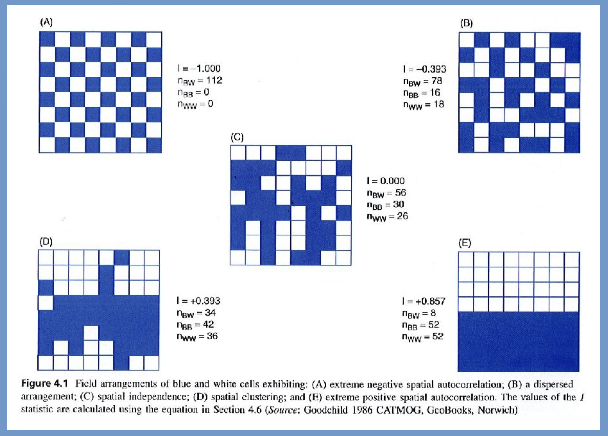
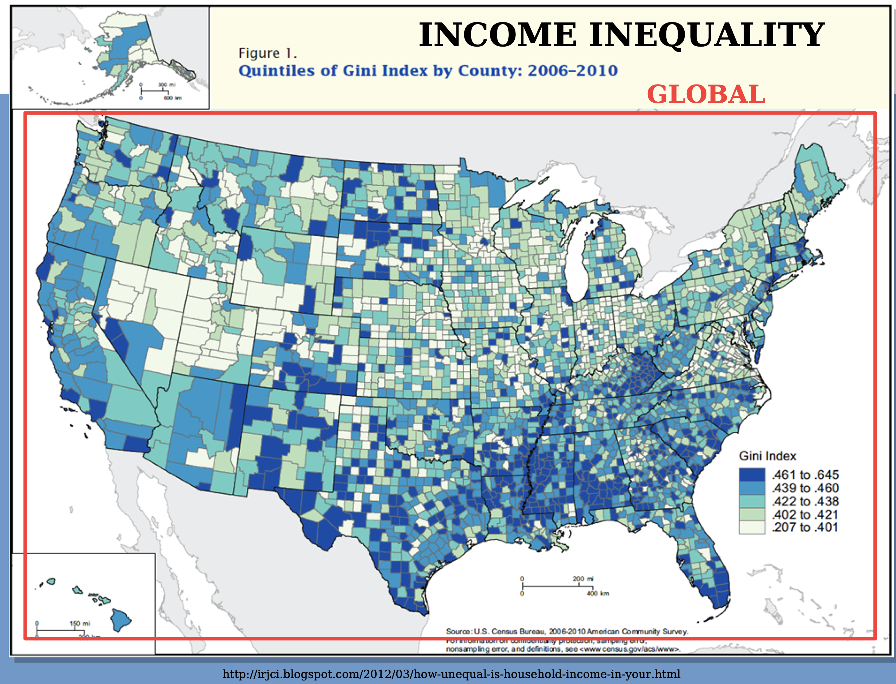
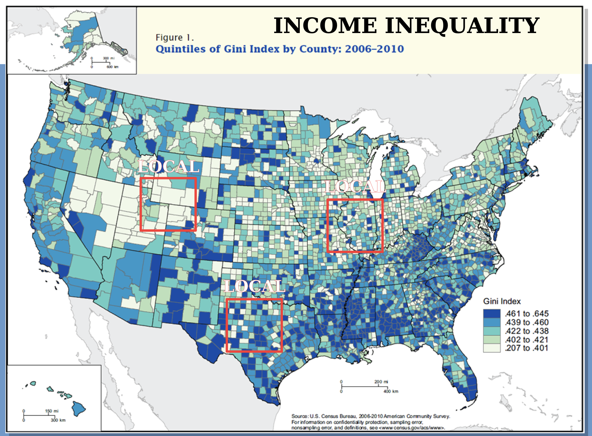
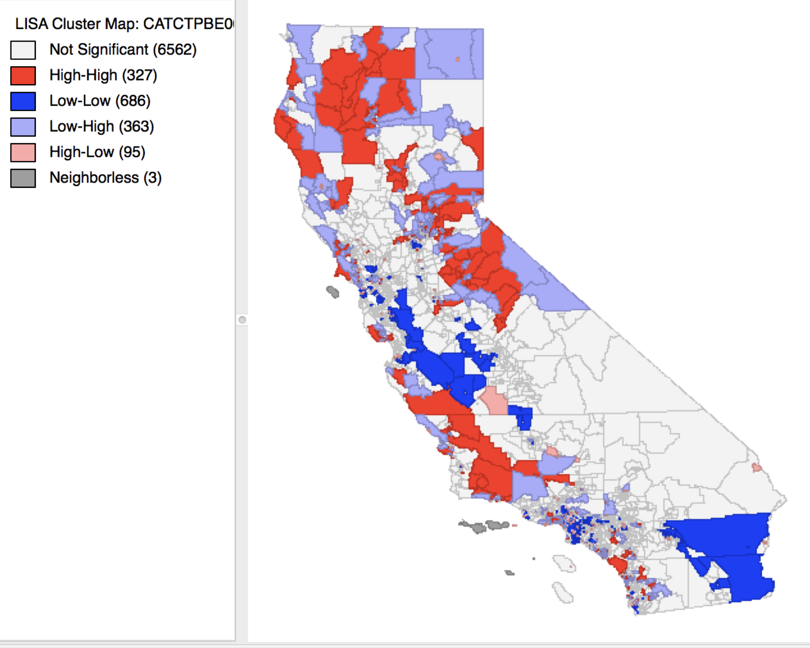

# Lecture 3: Area Pattern Analysis {background-color="#003366"}

## Transition: Points to Areas {.smaller}

::::: columns
::: {.column width="50%"}
### Point Pattern Data

- Discrete events/objects
- $(x, y)$ coordinates
- Questions:
  - Clustered or dispersed?
  - Random spacing?

### Methods

- Nearest Neighbor
- Quadrat Analysis
:::

::: {.column width="50%"}
### Areal Pattern Data

- **Continuous** spatial units
- Polygons (counties, tracts, regions)
- Questions:
  - Do adjacent areas have similar values?
  - Spatial clustering of attributes?

### Methods (Today)

- **Join Count Analysis**
- **Moran's I** (global & local)
:::
:::::

------------------------------------------------------------------------

## What is Areal Data? {.smaller}

### Definition

**Attributes measured or aggregated over spatial units**

### Characteristics

- **Complete coverage** of study area
- **Mutually exclusive** units
- Values represent entire area (not points)
- **Neighborhood structure** defined by adjacency/proximity

------------------------------------------------------------------------

## What is Areal Data? {.smaller}

### Examples

| Domain        | Spatial Unit  | Variable        |
|---------------|---------------|-----------------|
| Public Health | Counties      | Disease rate    |
| Economics     | States        | Unemployment    |
| Politics      | Precincts     | Vote share      |
| Environment   | Watersheds    | Pollution level |
| Demography    | Census tracts | Median income   |

------------------------------------------------------------------------

## Key Difference from Point Patterns

```{r}
#| echo: false
#| fig-width: 12
#| fig-height: 4

library(ggplot2)
library(gridExtra)

# Point pattern
set.seed(123)
pts <- data.frame(x = runif(40, 0, 10), y = runif(40, 0, 10))

p1 <- ggplot(pts, aes(x, y)) +
  geom_point(size = 3, color = "blue") +
  theme_minimal() +
  ggtitle("Point Pattern") +
  labs(subtitle = "WHERE are the events?")

# Areal data - create simple polygons
poly_data <- data.frame(
  x = c(0,2,2,0,0, 2,4,4,2,2, 4,6,6,4,4, 6,8,8,6,6,
        0,2,2,0,0, 2,4,4,2,2, 4,6,6,4,4, 6,8,8,6,6),
  y = c(0,0,2,2,0, 0,0,2,2,0, 0,0,2,2,0, 0,0,2,2,0,
        2,2,4,4,2, 2,2,4,4,2, 2,2,4,4,2, 2,2,4,4,2),
  group = rep(1:8, each = 5),
  value = rep(c(45, 67, 23, 78, 12, 89, 34, 56), each = 5)
)

p2 <- ggplot(poly_data, aes(x, y, fill = value, group = group)) +
  geom_polygon(color = "black", linewidth = 1) +
  scale_fill_gradient(low = "lightblue", high = "darkblue") +
  theme_minimal() +
  ggtitle("Areal Data") +
  labs(subtitle = "WHAT are the attribute values?", fill = "Value") +
  coord_fixed()

grid.arrange(p1, p2, ncol = 2)
```

**Point patterns**: Location of events is the variable\
**Areal data**: Attribute values across locations

------------------------------------------------------------------------

## Spatial Autocorrelation {.smaller}

### Core Concept

::: callout-important
## Tobler's First Law of Geography

"Everything is related to everything else, but near things are more related than distant things."
:::

### Spatial Autocorrelation Defined

**Correlation of a variable with itself across space**

- **Positive**: Similar values cluster spatially
  - High near high, low near low
- **Negative**: Dissimilar values are adjacent
  - High near low, low near high
- **Zero**: No spatial pattern (independence)

------------------------------------------------------------------------

## Why Spatial Autocorrelation Matters {.smaller}

### Theoretical Importance

- **Diffusion processes**: Contagion, influence, spread
- **Common exposures**: Environmental factors affect neighbors
- **Spatial spillovers**: Economic/social interactions

------------------------------------------------------------------------

## Why Spatial Autocorrelation Matters {.smaller}

### Practical Applications

- Identify spatial clusters (hot spots)
- Disease surveillance
- Environmental justice
- Economics (Real estate), Political Science etc etc.

------------------------------------------------------------------------

## Why Spatial Autocorrelation Matters {.smaller}

### Statistical Implications

- Violates **independence** assumption of classical statistics
- Standard errors underestimated
- Significance tests invalid
- Need spatial statistical methods

------------------------------------------------------------------------

## Defining Spatial Neighbors {.smaller}

::: callout-note
## Fundamental Question

Who is a neighbor? This defines the spatial structure!
:::

### Common Approaches

1.  **Contiguity** (shared boundary)
    - **Rook**: Shared edge
    - **Queen**: Shared edge or vertex
    - **Higher-order**: Neighbors of neighbors
2.  **Distance**
    - Fixed distance threshold
    - K-nearest neighbors
    - Inverse distance weighting
3.  **Other**
    - Graph-based (networks), Time-based (diffusion)

------------------------------------------------------------------------

## Contiguity Definitions: Visual

```{r}
#| echo: false
#| fig-width: 10
#| fig-height: 4

# Create simple grid to show rook vs queen
grid <- expand.grid(x = 0:2, y = 0:2)
grid$id <- 1:9

# Central cell is #5
center_cell <- data.frame(x = c(1, 2, 2, 1, 1), y = c(1, 1, 2, 2, 1))

# Rook neighbors (4 neighbors)
rook_neighbors <- data.frame(
  x = c(0,1,1,0,0, 2,3,3,2,2, 1,2,2,1,1, 1,2,2,1,1),
  y = c(1,1,2,2,1, 1,1,2,2,1, 0,0,1,1,0, 2,2,3,3,2),
  group = rep(1:4, each = 5)
)

p1 <- ggplot() +
  geom_rect(xmin = 0, xmax = 3, ymin = 0, ymax = 3, 
            fill = NA, color = "gray50") +
  geom_polygon(data = center_cell, aes(x, y), 
               fill = "yellow", alpha = 0.7, color = "black", linewidth = 1) +
  geom_polygon(data = rook_neighbors, aes(x, y, group = group), 
               fill = "lightblue", alpha = 0.5, color = "black", linewidth = 0.5) +
  geom_vline(xintercept = 0:3, color = "gray30") +
  geom_hline(yintercept = 0:3, color = "gray30") +
  annotate("text", x = 1.5, y = 1.5, label = "A", size = 8) +
  ggtitle("ROOK: Shared Edge (4 neighbors)") +
  theme_void() +
  theme(plot.title = element_text(hjust = 0.5)) +
  coord_fixed()

# Queen neighbors (8 neighbors)
queen_neighbors <- data.frame(
  x = c(0,1,1,0,0, 2,3,3,2,2, 1,2,2,1,1, 1,2,2,1,1,
        0,1,1,0,0, 2,3,3,2,2, 0,1,1,0,0, 2,3,3,2,2),
  y = c(1,1,2,2,1, 1,1,2,2,1, 0,0,1,1,0, 2,2,3,3,2,
        0,0,1,1,0, 0,0,1,1,0, 2,2,3,3,2, 2,2,3,3,2),
  group = rep(1:8, each = 5)
)

p2 <- ggplot() +
  geom_rect(xmin = 0, xmax = 3, ymin = 0, ymax = 3, 
            fill = NA, color = "gray50") +
  geom_polygon(data = center_cell, aes(x, y), 
               fill = "yellow", alpha = 0.7, color = "black", linewidth = 1) +
  geom_polygon(data = queen_neighbors, aes(x, y, group = group), 
               fill = "lightblue", alpha = 0.5, color = "black", linewidth = 0.5) +
  geom_vline(xintercept = 0:3, color = "gray30") +
  geom_hline(yintercept = 0:3, color = "gray30") +
  annotate("text", x = 1.5, y = 1.5, label = "A", size = 8) +
  ggtitle("QUEEN: Shared Edge or Vertex (8 neighbors)") +
  theme_void() +
  theme(plot.title = element_text(hjust = 0.5)) +
  coord_fixed()

grid.arrange(p1, p2, ncol = 2)
```

------------------------------------------------------------------------

## Example: Simple Weights Matrix

```{r}
#| echo: false

library(knitr)

# Create example for 4 areas
W_example <- data.frame(
  Area = c("A", "B", "C", "D"),
  A = c(0, 1, 1, 0),
  B = c(1, 0, 0, 1),
  C = c(1, 0, 0, 1),
  D = c(0, 1, 1, 0)
)

kable(W_example, caption = "Binary Spatial Weights Matrix (Queen Contiguity)")
```

**Interpretation**: - A is neighbor to B and C - B is neighbor to A and D - C is neighbor to A and D - D is neighbor to B and C

# Join Count Analysis {background-color="#004d00"}

------------------------------------------------------------------------

## Learning Check

- Two maps contain the same number of “black” and “white” areas. Map A has substantially fewer black-white joins than expected, while Map B has substantially more. Describe the spatial pattern represented by each map and explain why.

- A study finds a nonsignificant global Moran’s I but identifies several significant local Moran’s I values. Is this possible? Explain what the global and local statistics measure differently.


------------------------------------------------------------------------

------------------------------------------------------------------------

## Join Count Analysis: Introduction {.smaller}

### Purpose

**Analyze spatial patterns of CATEGORICAL data**

### Key Concept

A **"join"** is a connection between two adjacent areas

### Types of Joins

| Join Type            | Description                              |
|----------------------|------------------------------------------|
| **Black-Black (BB)** | Two adjacent "black" areas               |
| **White-White (WW)** | Two adjacent "white" areas               |
| **Black-White (BW)** | Adjacent areas with different categories |

### The Question

Are there more same-category joins than expected by chance?

------------------------------------------------------------------------

## Join Count: The Logic {.smaller}

### Observed vs. Expected

**Observed**: Count actual joins in the data

**Expected**: What would we expect under random arrangement?

### Hypotheses

- $H_0$: Spatial pattern is random (no spatial autocorrelation)
- $H_A$: Clustering exists
  - **Positive autocorrelation**: More BB and WW joins than expected
  - **Negative autocorrelation**: More BW joins than expected

------------------------------------------------------------------------

## Join Count: Visual Example

```{r}
#| echo: false
#| fig-width: 12
#| fig-height: 4

# Create three patterns: clustered, random, dispersed
# Clustered
clust_vals <- c(1,1,1,1,0,0,0,0,0,
                1,1,1,1,0,0,0,0,0,
                1,1,1,1,0,0,0,0,0,
                1,1,1,1,0,0,0,0,0,
                0,0,0,0,0,1,1,1,1)

clust_df <- data.frame(
  x = rep(0:8, times = 5) + 0.5,
  y = rep(0:4, each = 9) + 0.5,
  value = clust_vals
)

# Random
set.seed(999)
rand_df <- data.frame(
  x = rep(0:8, times = 5) + 0.5,
  y = rep(0:4, each = 9) + 0.5,
  value = sample(0:1, 45, replace = TRUE, prob = c(0.5, 0.5))
)

p1 <- ggplot(clust_df, aes(x, y, fill = factor(value))) +
  geom_tile(color = "grey80", linewidth = 2) +
  scale_fill_manual(values = c("0" = "white", "1" = "black"),
                    labels = c("White", "Black")) +
  theme_void() +
  theme(legend.position = "bottom") +
  ggtitle("Clustered (Positive SA)") +
  labs(subtitle = "Many BB and WW joins", fill = "") +
  coord_fixed()

p2 <- ggplot(rand_df, aes(x, y, fill = factor(value))) +
  geom_tile(color = "grey80", linewidth = 2) +
  scale_fill_manual(values = c("0" = "white", "1" = "black"),
                    labels = c("White", "Black")) +
  theme_void() +
  theme(legend.position = "bottom") +
  ggtitle("Random (No SA)") +
  labs(subtitle = "Expected number of joins", fill = "") +
  coord_fixed()

grid.arrange(p1, p2, ncol = 2)
```

## Join Count: Test Statistic

### Z-Score

$$Z_{join} = \frac{O_{BW} - E_{BW}}{\sigma_{BW}}$$

where: - $O_{BW}$ = observed number of Black-White joins - $E_{BW}$ = expected number under randomness

### Interpretation

- **Positive** $Z$: More BW joins than expected (negative SA)
- **Negative** $Z$: Fewer BW joins than expected (positive SA / clustering)
- $|Z| > 1.96$ → Significant at $\alpha = 0.05$

------------------------------------------------------------------------

## Join Count Example: US Obesity {.smaller}

**From your reading**: State obesity levels 1995-2020

### Setup

- States classified as **above** or **below** national average
- Queen contiguity weights
- Binary categorization per year

### Results (2020)

| Join Type       | Observed | Expected |
|-----------------|----------|----------|
| **Above-Above** | 26       | 21       |
| **Below-Below** | 27       | 32       |
| **Dissimilar**  | 22       | 53.75    |

**Test**: $Z = -6.40$, $p < 0.001$

**Conclusion**: Significant **positive spatial autocorrelation**\
States with similar obesity levels cluster together

------------------------------------------------------------------------

## Join Count: Interpretation Tips {.smaller}

### What Positive SA Means

- Similar values cluster spatially
- Neighbors tend to be alike
- Evidence of:
  - Diffusion processes
  - Common exposures
  - Spatial spillovers

------------------------------------------------------------------------

## Join Count: Interpretation Tips {.smaller}

### What Negative SA Means (Rare)

- Dissimilar values adjacent
- "Checkerboard" pattern
- Possible:
  - Competition effects
  - Complementarity
  - Zoning/planning

### Non-Significance

- Random spatial arrangement
- No evidence of spatial pattern
- Independence assumption reasonable

------------------------------------------------------------------------

# Moran's I {background-color="#004d00"}

## Moran's I: Introduction {.smaller}

### Purpose

**Measure spatial autocorrelation for CONTINUOUS data**

### Key Differences from Join Count

- **Join Count**: Categorical (black/white, yes/no)
- **Moran's I**: Continuous (income, temperature, rates)

### Global Moran's I

- **Single value** summarizing spatial autocorrelation for entire study area
- Analogous to Pearson correlation, but for spatial data

### Range

- Typically: $-1 \leq I \leq +1$
- $I > 0$: Positive SA (clustering of similar values)
- $I \approx 0$: No SA (random)
- $I < 0$: Negative SA (dissimilar values adjacent)

------------------------------------------------------------------------

## Moran's I: Example {.smaller}

{fig-align="center"}

------------------------------------------------------------------------

## Moran's I: Example {.smaller}

{fig-align="center"}

------------------------------------------------------------------------

## Moran's I: Intuition {.smaller}

### What It Calculates

**Product of deviations for neighboring areas**

### Positive I (Clustering)

- High values near high values: $(+)(+) = +$
- Low values near low values: $(-)(-)  = +$
- Cross-products tend to be positive

### Negative I (Dispersion)

- High values near low values: $(+)(-) = -$
- Low values near high values: $(-)(+) = -$
- Cross-products tend to be negative

### Random (I ≈ 0)

- Mix of positive and negative cross-products
- Cancel out on average

------------------------------------------------------------------------

## Moran's I: Worked Example {.smaller}

**Pennsylvania County Obesity Levels** (from reading)

### Setup

- $n = 67$ counties
- Variable: Obesity rate (%)
- Queen contiguity weights

### Results

| Statistic  | Value    |
|------------|----------|
| Moran's I  | 0.69     |
| Expected I | -0.015   |
| Variance   | 0.0043   |
| Z-score    | 10.8     |
| p-value    | \< 0.001 |

**Interpretation**: **Strong positive spatial autocorrelation**\
Counties with similar obesity rates cluster together

------------------------------------------------------------------------

## Global vs. Local Measures {.smaller}

::::: columns
::: {.column width="50%"}
### Global Moran's I

- **One value** for entire study area
- "Is there clustering?"
- Like a correlation coefficient
- Summary statistic

### Limitations

- Doesn't tell you WHERE
- May miss local variation
- Average over whole area
:::

::: {.column width="50%"}
### Local Moran's I (LISA)

- **One value per area**
- "Where is clustering?"
- Identifies hot spots / cold spots
- Spatial outliers

### Advantages

- Maps of local patterns
- Identifies specific locations
- Heterogeneous patterns
:::
:::::

::: callout-tip
Use **global** to test for overall SA, then **local** to find where
:::

------------------------------------------------------------------------

## Local Moran's I (LISA) {.smaller}

{fig-align="center"}

------------------------------------------------------------------------

## Local Moran's I (LISA) {.smaller}

{fig-align="center"}

------------------------------------------------------------------------

## Local Moran's I (LISA) {.smaller}

### Formula

$$I_i = \frac{(x_i - \bar{x})}{S_i^2} \sum_{j} w_{ij}(x_j - \bar{x})$$

where: - $I_i$ = local Moran's I for area $i$ - $S_i^2 = \frac{\sum (x_i - \bar{x})^2}{n}$ (variance) - $w_{ij}$ = spatial weights

### Interpretation for Area $i$

- **High positive** $I_i$: Area similar to neighbors
  - **High-High**: High value surrounded by high
  - **Low-Low**: Low value surrounded by low
- **Negative** $I_i$: Area different from neighbors
  - **High-Low**: High value surrounded by low (outlier)
  - **Low-High**: Low value surrounded by high (outlier)

------------------------------------------------------------------------

## LISA: Cluster Types

{fig-align="center"}

------------------------------------------------------------------------

## LISA: Cleveland Racial Composition {.smaller}

**Example from reading**: Census block groups

### Four Groups Analyzed

- Asian, Black, White, Hispanic

### Key Findings (Moran's I values)

| Group        | Moran's I | Z     | p-value | Interpretation         |
|--------------|-----------|-------|---------|------------------------|
| **Asian**    | 0.35      | 18.39 | 0.000   | Moderate clustering    |
| **Black**    | 0.58      | 64.6  | 0.000   | Strong clustering      |
| **White**    | 0.64      | 65.4  | 0.000   | Strong clustering      |
| **Hispanic** | 0.81      | 65.7  | 0.000   | Very strong clustering |

**Conclusion**: Significant residential segregation across all groups\
Hispanic communities most strongly clustered

------------------------------------------------------------------------

## Comparing Area Pattern Methods {.smaller}

| Feature            | Join Count                | Moran's I                 |
|--------------------|---------------------------|---------------------------|
| **Data type**      | Categorical               | Continuous                |
| **Output**         | Join counts               | Correlation-like index    |
| **Range**          | Count values              | -1 to +1                  |
| **Interpretation** | Number of joins           | Degree of autocorrelation |
| **Local version**  | No standard version       | LISA (Local Moran's I)    |
| **Use cases**      | Land use, binary outcomes | Rates, prices, densities  |

### Complementary Approaches

- Both test spatial autocorrelation
- Both require defining neighbors
- Both compare observed to expected under randomness

------------------------------------------------------------------------

## Practical Applications {.smaller}

### Public Health

- **Disease mapping**: Identify disease clusters
- **Health disparities**: Unequal access to care
- **Outbreak detection**: Early warning systems

### Urban Planning

- **Gentrification**: Spreading neighborhood change
- **Segregation**: Residential clustering by race/income
- **Housing markets**: Price spillovers

### Environmental

- **Pollution**: Clustering of environmental hazards
- **Environmental justice**: Disproportionate exposure
- **Climate adaptation**: Regional vulnerability

### Economics

- **Unemployment**: Regional labor markets
- **Innovation**: Technology spillovers
- **Poverty**: Persistent spatial poverty traps

------------------------------------------------------------------------

## Common Issues and Solutions {.smaller}

### Issue 1: Modifiable Areal Unit Problem (MAUP)

- Results sensitive to zone definition
- **Solution**: Test multiple aggregations, report sensitivity

### Issue 2: Boundary Definition

- Edge areas have fewer neighbors
- **Solution**: Consider broader study area, report boundary effects

### Issue 3: Choosing Neighbors

- Contiguity vs. distance? Rook vs. Queen?
- **Solution**: Test multiple definitions, justify choice theoretically

### Issue 4: Statistical vs. Practical Significance

- Large samples → everything significant
- **Solution**: Report effect sizes (Moran's I value), visualize

------------------------------------------------------------------------

## Assumptions and Limitations {.smaller}

### Key Assumptions

1.  **Stationarity**: Process constant across space
    - May not hold in heterogeneous regions
2.  **Isotropy**: Relationships same in all directions
    - Geographic barriers may violate this
3.  **Appropriate neighborhood definition**
    - Neighbors must be meaningful
4.  **Independence of areas** (for inference)
    - Actually violated if SA exists! (parametric bootstrap helps)

### Limitations

- **Descriptive, not causal**
- **Cannot distinguish processes** (multiple processes → same pattern)
- **Scale-dependent** (MAUP)

------------------------------------------------------------------------

## Advanced Topics (Brief Overview) {.smaller}

### Other Spatial Autocorrelation Measures

- **Geary's C**: More sensitive to local differences
- **Getis-Ord G**: Hot spot analysis
- **Spatial correlogram**: SA at multiple distances

### Spatial Regression Models

- When SA exists, OLS invalid
- **Spatial lag model**: Y depends on neighbor Y
- **Spatial error model**: Errors spatially correlated

### Space-Time Analysis

- Extend to temporal dimension
- Emerging/declining clusters
- **Knox test**, **Space-time scan statistics**

::: notes
These go beyond ESDA into confirmatory spatial analysis
:::

------------------------------------------------------------------------

## Best Practices Summary {.smaller}

### Workflow for Area Pattern Analysis

1.  **Visualize**: Create choropleth maps
2.  **Define neighbors**: Justify choice
3.  **Test globally**: Join Count or Moran's I
4.  **If significant, test locally**: LISA
5.  **Map results**: Show cluster locations
6.  **Interpret substantively**: Connect to theory/process

------------------------------------------------------------------------

## Best Practices Summary {.smaller}

### Reporting Checklist

✓ Study area definition and rationale\
✓ Neighborhood definition (rook/queen/distance)\
✓ Weighting scheme (binary/row-standardized)\
✓ Global test results (statistic, p-value)\
✓ Local analysis (if applicable)\
✓ Maps of patterns\
✓ Substantive interpretation
