```{r}
library(tidyverse)
library(readr)
```

## Outline

-   Measurement error and Biases in Data

-   Geographic Data Classification

-   Selected Issues with description of Spatial Data

## Errors and Biases in Quantitative Research

-   Is there an error-free dataset, method, or Analysis?
    -   Garbage in, Garbage out
-   What are sources of error?
    -   How do we critically think about them?
    -   How do we quantify them or account for them

## Error in Data

-   Original (source) data

-   Collection or creation

    ```         
    -   Eg. GPS error
    ```

-   Processing

    -   eg. miscalculated value(s)

-   Analysis

    -   eg. Merging attribute data incorrectly etc.

-   Errors in Data [**propagate downstream**]{.underline} !!

## Measurement Error

-   Potential error associated with the measurement of any data
    -   Precision
    -   Accuracy
    -   Validity
    -   Reliability

## Lets take an example

](assets/acc_prec_lab_nolab.png){fig-align="center"}

## Lets take an example

](assets/acc_prec_lab.png){fig-align="center"}

## Precision {.smaller}

::: incremental
-   Consistency of the measurement method or process

    -   often associated with calibration of a measuring instrument

    -   Eg. ability to detect decimal places

    -   Is more exactness always good?

-   Beware of spurious precision

    -   sophisticated software -\> more decimal places

    -   Eg. GPS coordinates

-   Measure of Consistency and Variability/Efficiency

    -   Range, Standard Deviation, Variance etc.
:::

## Accuracy

-   Two separate types with geographic data

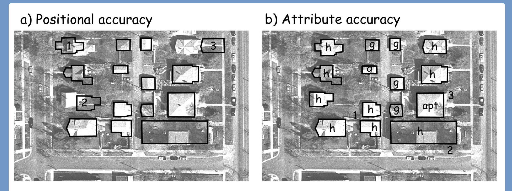{fig-align="center"}

## Accuracy

::: incremental
-   Extent of system-wide bias in measurement process

    -   How close is the measured value is to the true value
    -   Often, what we think of as “lack of error”

-   Dart Analogy

    -   Accuracy -\> hitting the right target
    -   Precision -\> hitting same mark over and over again

-   Which is more important?
:::

## Accuracy and Precision

::: incremental
-   They are NOT THE SAME THING!

-   Don't be fooled by highly precise attribute values in data

    – Sometimes, unnecessary precision masks inaccurate data

-   For example, a value is reported as 51.23854

    -   True value of this attribute is 53

    -   The “extra” decimal places in the reported value are not providing anything except...

        – Undue confidence in the “accuracy” of the value

-   Beware of overprecise, inaccurate data
:::

## Validity

::: incremental
-   How well is our data 'capturing' the underlying process

    -   Also called variable operationalization
    -   Abstraction of real world into constructs/models

-   Discuss Examples (Groups 1,2,3)

    -   Impact of [***Education***]{.underline} on ***i[ncome]{.underline}***
    -   Impact of [***Greenery***]{.underline} on [***Physical Activity***]{.underline}
    -   Impact of [***Air Quality***]{.underline} on your [***overall health***]{.underline}
:::

## Reliability

::: incremental
-   How well is our data 'measuring' the underlying process across space and time

-   Will the same data collection instrument capture the same underlying process across other geographical settings?

-   Discuss Examples (Groups 1,2,3)

    -   Measuring COVID rates across States in the US
    -   Measuring how global temperature changes in the past 100 years
    -   Measuring trends in autism cases over the past 20 years
:::

## Reliability

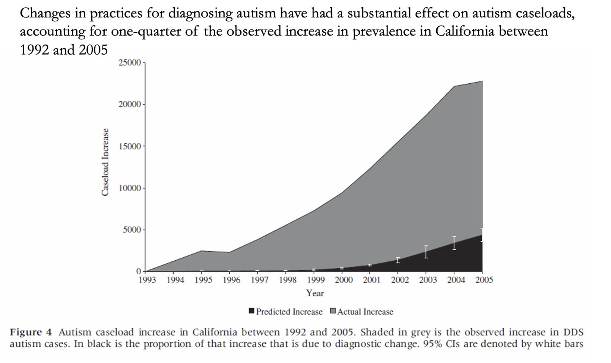{fig-align="center"}

## Reliability

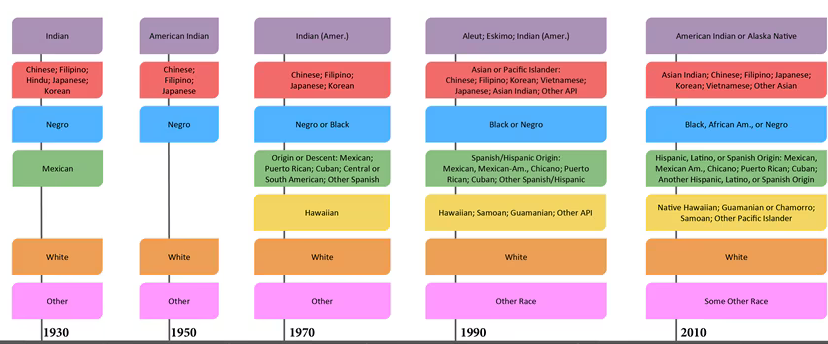{fig-align="center"}

## Other Complications with Geographical Data

-   How can geographical data affect the value and magnitude of descriptive statistics

    -   Impact of External Boundary Delineation

    -   Modifiable Areal Unit Problem

        -   Modification of internal (subarea) boundaries

        -   Change in spatial scale/resolution/aggregation

## Impact of External Boundary Delineation

](assets/flint_mich.jpg){fig-align="center"}

## Impact of External Boundary Delineation

-   Eg. Distribution of Crime in Columbia

-   Eg. Cholera Outbreak in London

-   Mean, standard deviation, etc. may also be affected, but hard to predict, how

-   Evaluate descriptive statistics in relation to study area!

## Modifiable Areal Unit Problem

-   Modification of Internal Subarea Boundaries

    -   Grouping or Zoning Effect

-   Change in spatial scale/resolution/aggregation

    -   Scale or Aggregation Effect

## Grouping or Zoning Effect

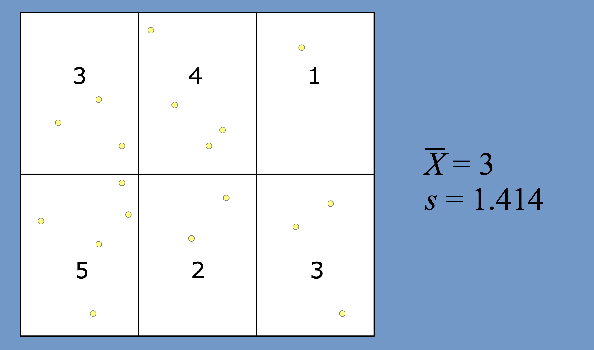{fig-align="center"}

## Grouping or Zoning Effect

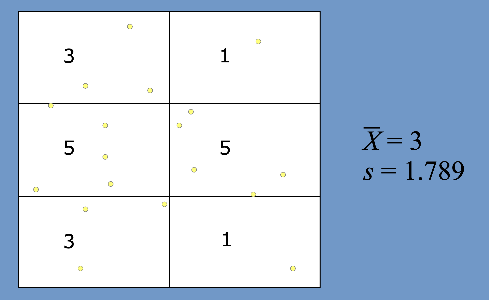{fig-align="center"}

## Grouping or Zoning Effect

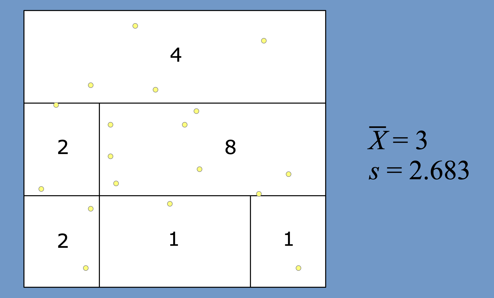{fig-align="center"}

## Grouping or Zoning Effect

::: columns
::: {.column width="33%"}
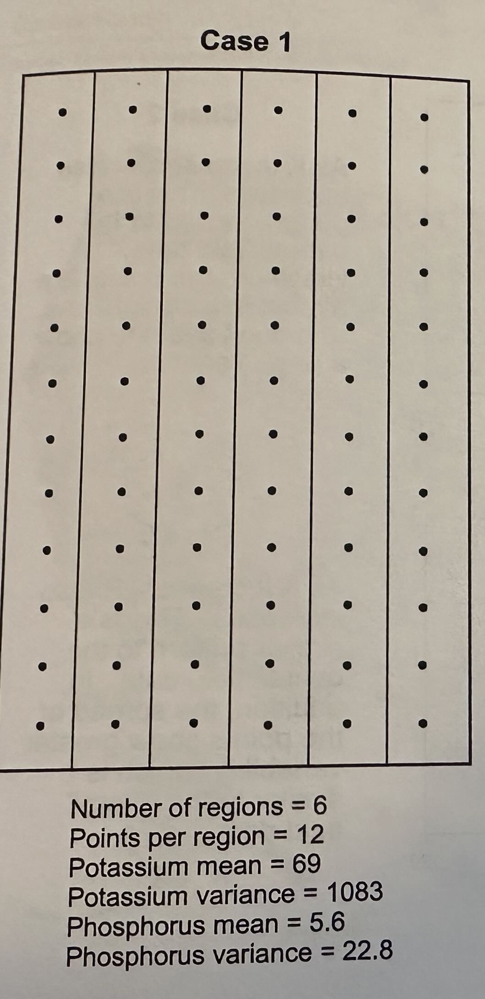{fig-align="center"}
:::

::: {.column width="33%"}
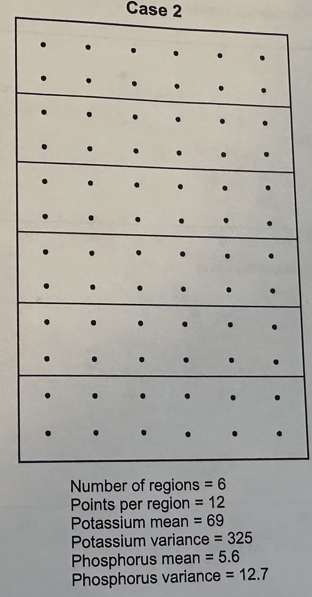{fig-align="center"}
:::

::: {.column width="34%"}
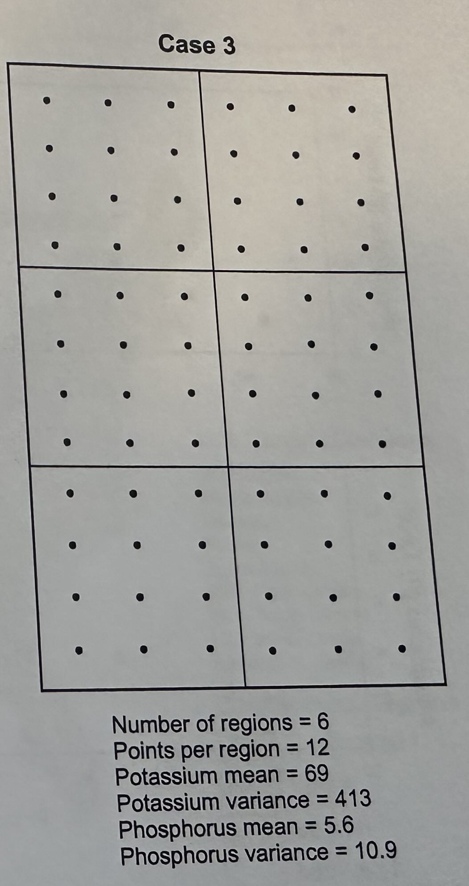{fig-align="center"}
:::
:::

## Grouping or Zoning Effect

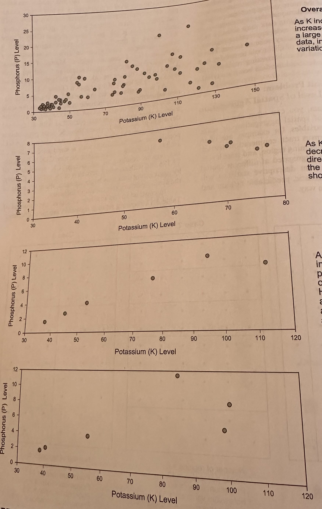{fig-align="center"}

## Scale or Aggregation Effect

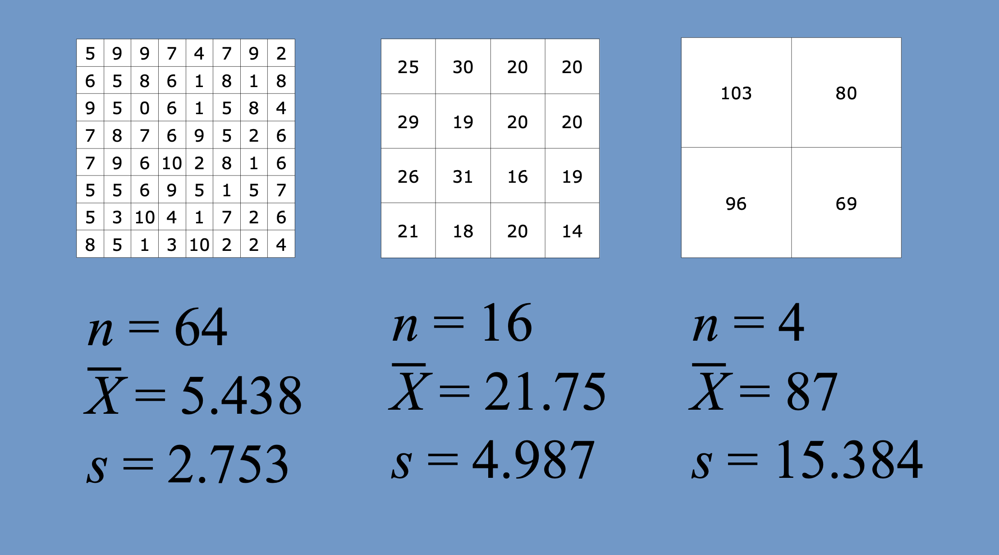{fig-align="center"}

## Scale or Aggregation Effect

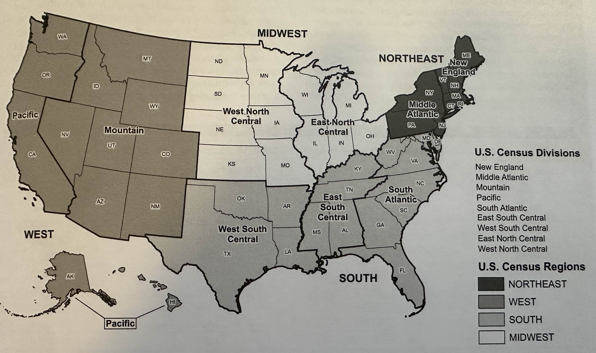{fig-align="center"}

## Scale or Aggregation Effect

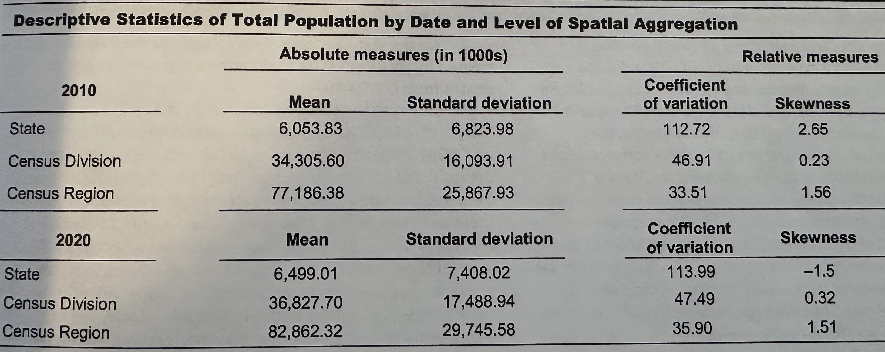{fig-align="center"}

## Conclusion

-   Be critical of your data!

    -   Read Metadata and documentations!
    -   Think about effects of the choice of your study area
    -   How about data in your current form affect your interpretation
    -   Think about alternative ways to show/present your data
    -   What would have happened if your data was some other way
    -   Persevere, Rinse, Repeat!

## Recap: Descriping Quantitative and Geographic Data {.smaller}

-   Skills learned

    -   Detecting different data types (including Geographic Data)
    -   Descriptive (Spatial) Statistics
    -   (Geographic) Data Visualization
    -   Presenting code and results in a readable

-   HW 1 on Describing (geographic) data and Interpretation

    -   Released Friday (Sept 19)
    -   Due Sunday, 11:59 pm on Oct 5
