```{r}
library(tidyverse)
library(readr)
```

## Outline

-   Bootstrapping

-   Confidence Intervals

-   Hypothesis Testing

## Recall {.smaller}

::: incremental
-   Population Parameter
    -   "True value of interest"
    -   often unobservable directly
-   Sample statistic
    -   estimate of the parameter from a sample of data
-   Central Limit Theorem
    -   mean of several sample statistics = population parameter
:::

## Central Limit Theorem

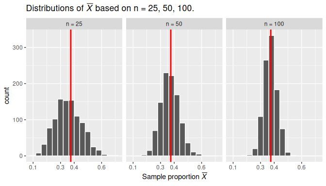

## Bootstrapping

::: incremental
-   How do we find variability in our statistic
    -   Real world feasibility
-   What can you do?
    -   Sampling again from the same population?
    -   Sampling again from a different population
:::

## Bootstrapping {.smaller}

-   Estimating Population based on sample

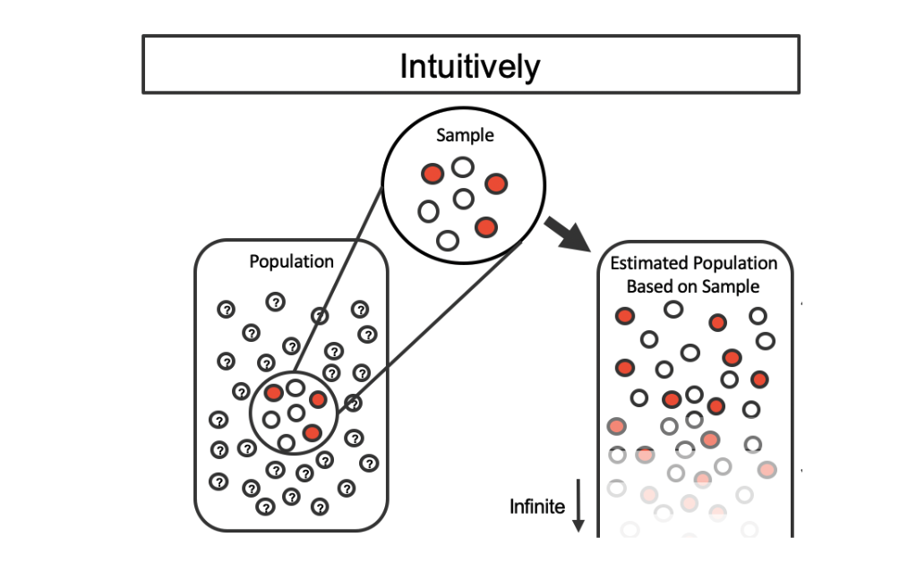

## Bootstrapping {.smaller}

-   Collecting k samples from an estimated population
-   measure of sample to sample variability
-   differences are due entirely to sampling variability

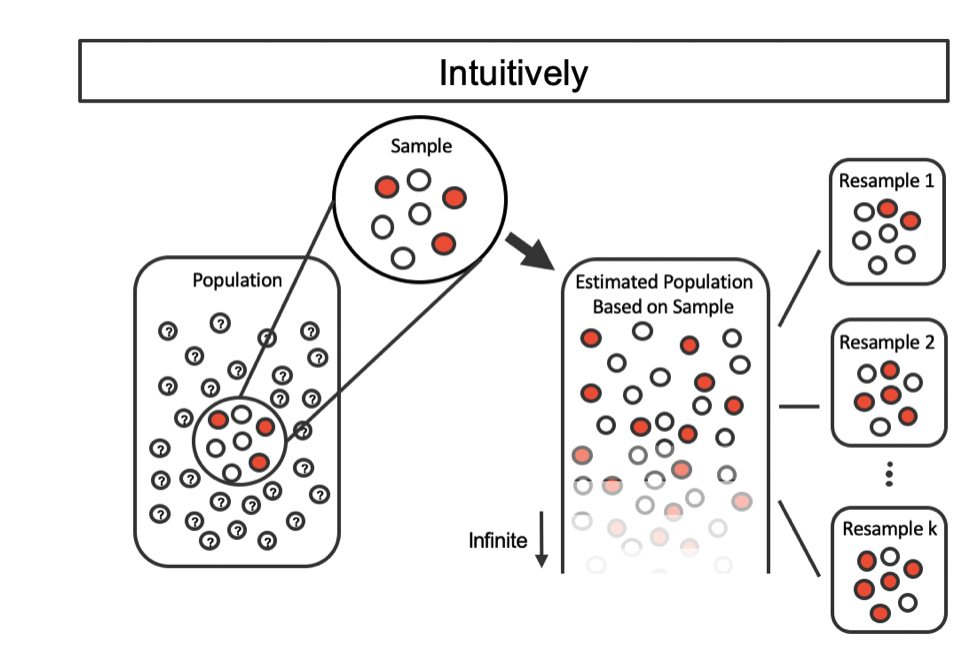

## Bootstrapping {.smaller}

-   Collecting k samples from an estimated population
-   measure of sample to sample variability
-   differences are due entirely to sampling variability

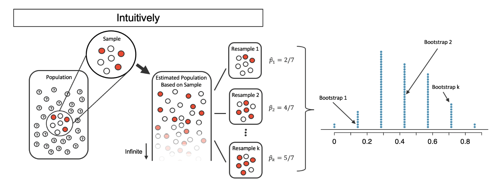

## Bootstrapping {.smaller}

-   In practice, estimating population is very difficult

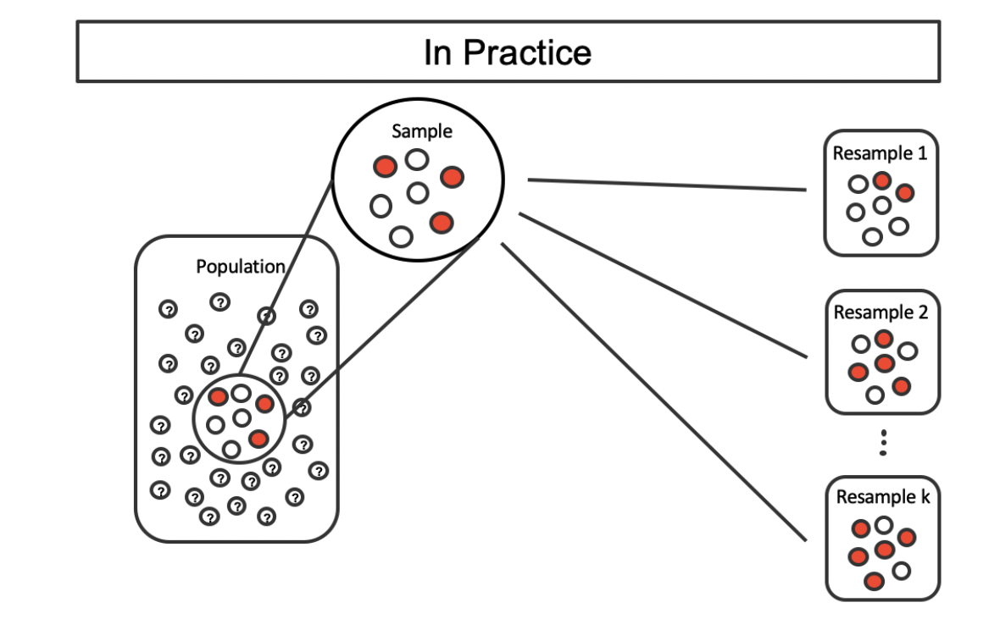

## Bootstrapping {.smaller}

-   In practice, estimating population is very difficult

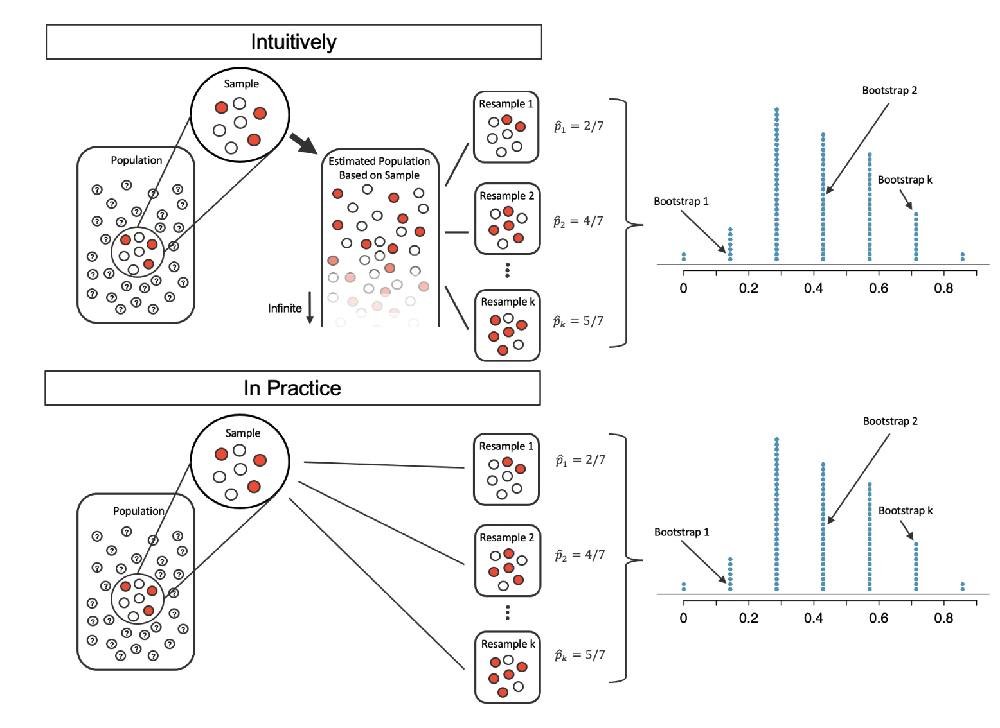

## Example: {.smaller}

One consultant tried to attract patients by noting the average complication rate for liver donor surgeries in the US is about 10%, but her clients have had only 3 complications in the 62 liver donor surgeries she has facilitated. She claims this is strong evidence that her work meaningfully contributes to reducing complications (and therefore she should be hired!).

## Bootstrap Percentile Confidence Interval {.smaller}

Does the interval estimate of 0% to 11.3% for the true probability of complication indicate that the surgical consultant has a lower rate of complications than the national average

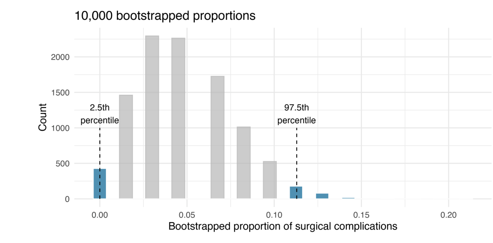

## Confidence Intervals {.smaller}

-   Plausible range of values for the population parameter
-   If we want to be very certain we capture the population parameter, should we use a wider interval (e.g., 99%) or a smaller interval (e.g., 80%)

## Bootstrap confidence interval {.smaller}

-   Sampling WITH replacement
-   The bootstrap distribution will likely not have the same center as the sampling distribution. In other words, bootstrapping cannot improve the quality of an estimate.
-   Even if the bootstrap distribution might not have the same center as the sampling distribution, it will likely have very similar shape and spread. In other words, bootstrapping will give you a good estimate of the standard error.

## Other ways to construct Confidence Intervals

-   Standard Error Method
    -   Sample mean distribution needs to normally distributed

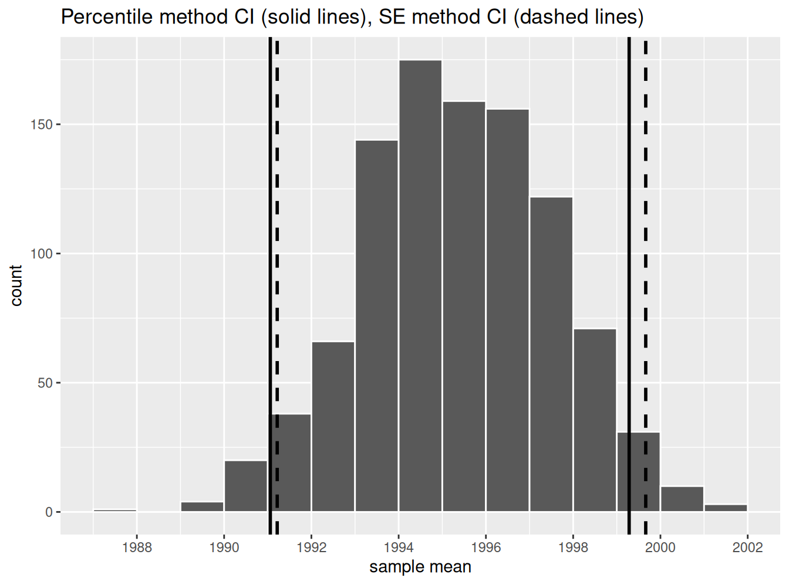

## Interpreting Confidence Intervals

-   Did the net capture the fish
-   Did the 95% CI capture the true population parameter
-   Will every 95% CI capture the true parameter

## Interpreting Confidence Intervals

If we repeated our sampling procedure a large number of times, we expect about 95% of the resulting 95% confidence intervals to capture the value of the population parameter.

## Interpreting Confidence Intervals

-   95% CI 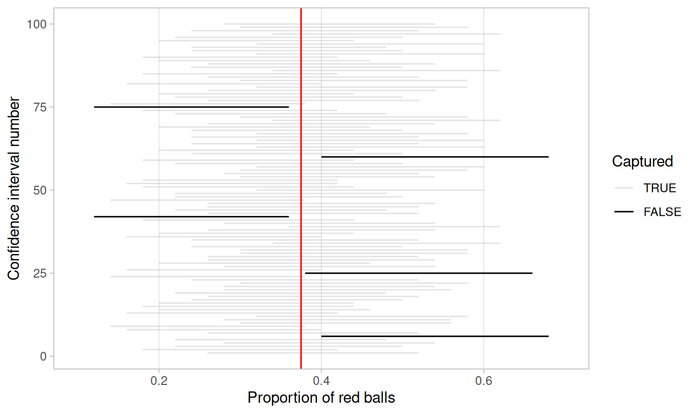 

## Interpreting Confidence Intervals
-   80% CI 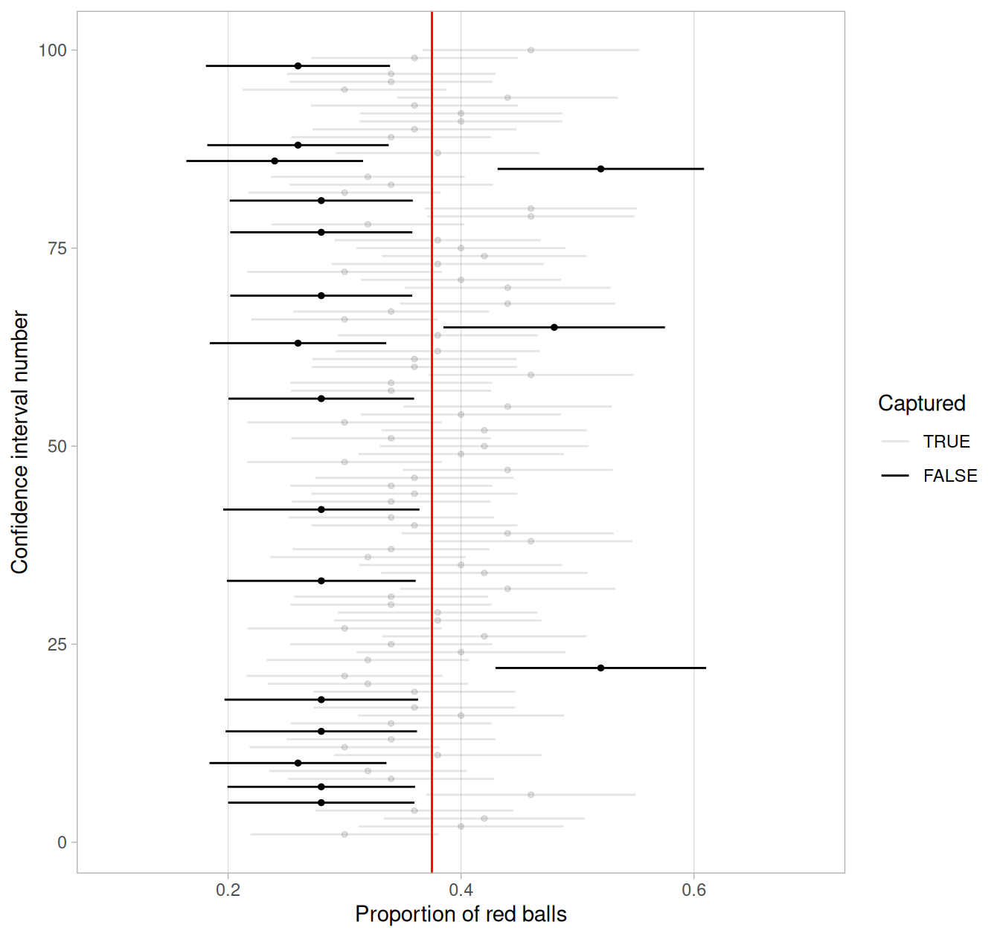 

## Interpreting Confidence Intervals
-   Impact of sample size 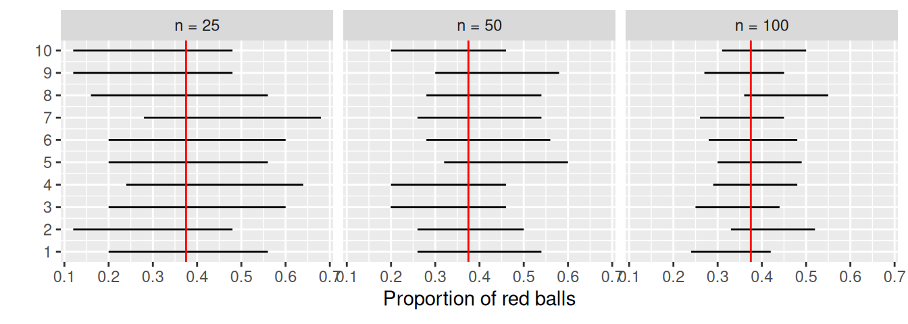

## Interpreting Confidence Intervals

-   Impact of Significance level 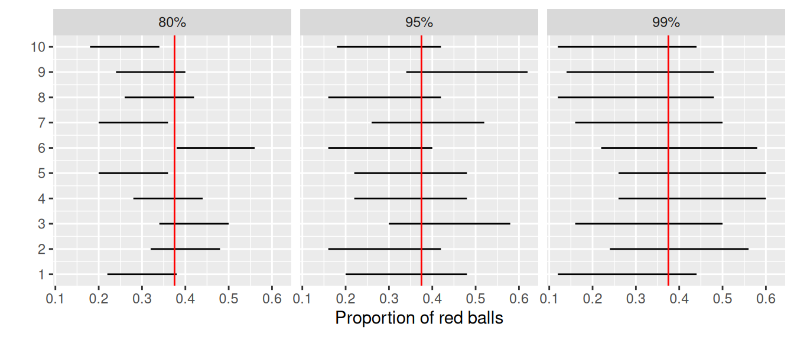

## Hypothesis Testing

Moderndive Gender discrimination example

## Hypothesis Testing

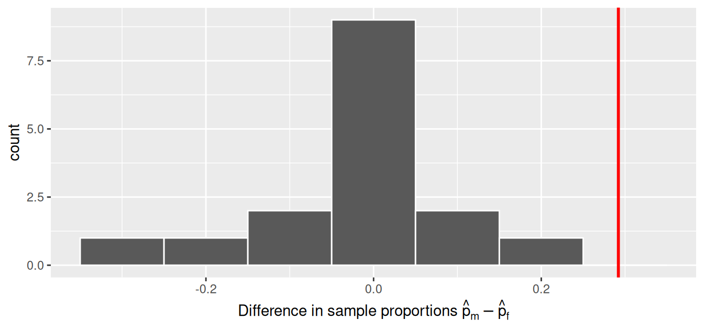

## P-value

A p-value is the probability of obtaining a test statistic just as or more extreme than the observed test statistic *assuming the null hypothesis* H0 is true.

## Interpreting Hypothesis Tests

-   If the p-value is less than α, then we *reject* the null hypothesis H0 in favor of HA.

-   If the p-value is greater than or equal to α, we *fail to reject* the null hypothesis H0.

## Your turn

-   What is your null hypothesis
-   What is your alternative hypothesis
