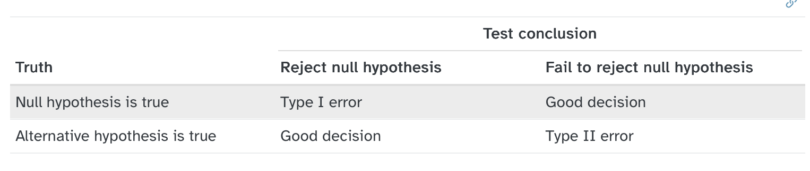
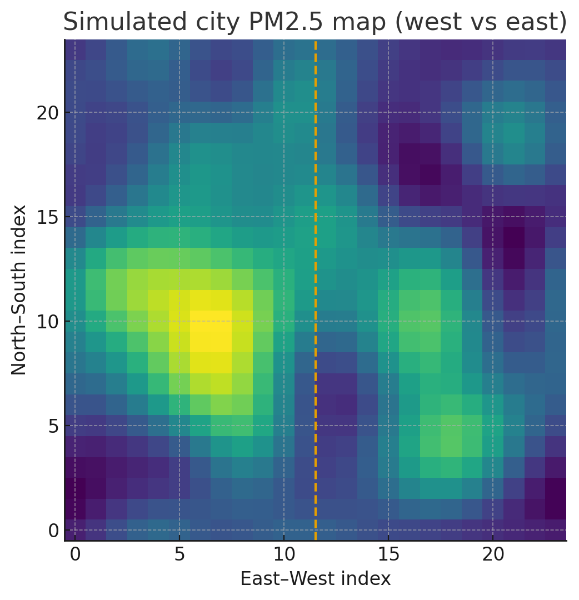

```{r}
library(tidyverse)
library(readr)
library(infer)

dat_1prop <- read_rds("./data/dat_1prop.rds")
dat_2prop <- read_rds("./data/dat_2prop.rds")
dat_1mean <- read_rds("./data/dat_1mean.rds")
```

## Outline

-   Errors in Hypothesis Testing

-   Spatial Autocorrelation

-   Spatial Patterns


## Errors in Hypothesis Testing

-   Hypothesis tests are not flawless
-   Think about wrongful convictions
-   We can quantify and control the rate of error

## Hypothesis Test Scenarios



## Hypothesis Test Scenarios

::: incremental
-   Null Hypothesis (H~0~): Defendant is innocent
-   Alternate Hypothesis (H~A~): Defendant is guilty
    -   What would type 1 error represent
    -   What would type 2 error represent
    -   Connections between type 1 and type 2
:::

## Adjusting for errors {.smaller}

-   Adjusting level of discernibility (instead of significance)
    -   Reflects the real-world consequences for your error
-   Adjusting Sample Size
    -   Large sample sizes \<- smaller p value
-   Adjusting Power
    - Ability to detect your hypothesized statistic

## Example: Food Safety Tests

A food safety inspector is called upon to investigate a restaurant with a few customer reports of poor sanitation practices. The food safety inspector uses a hypothesis testing framework to evaluate whether regulations are not being met. If he decides the restaurant is in gross violation, its license to serve food will be revoked.

-   Join menti.com **5134 0845**

## Answer the following question

As a diner, would you prefer that the food safety inspector requires strong evidence or very strong evidence of health concerns before revoking a restaurant’s license?

## Example - Flu vaccine study

-   H0: Old Flu Vaccine and New Flu Vaccine are the same

-   HA: New Vaccine is superior to Old Flu Vaccine

-   What would type 1 error be?

-   What would type 2 error be?

-   Which would be more of an issue?

## Other assumptions about hypothesis testing {.smaller}

::: incremental
-   Randomness

    -   Often not the case in the real world
    -   need to control for other factors

-   Independence

    -   Each sample is independent of the other
    -   Knowing something about one observation does not tell us anything about the other
    -   Spatial Statistics!!

-   Does not mean that alternate hypothesis is true

-   Misusing hypothesis testing (multiple testing)
:::

## Consider the following Scenario {.smaller}

Suppose your city deploys lots of low-cost PM2.5 sensors on a 24×24 grid (n = 576). There’s a warehouse district on the **west** side that sometimes creates a pollution plume. You ask a simple question:

> “Is the average PM2.5 higher on the **west** half of the city than on the **east** half?”

## Descriptive Map



## Hypothesis Testing as Usual

:::incremental

-   Mean (PM2.5~West~) = 53.02
-   Mean (PM2.5~East~) = 49.3
  
    -   p-value = very close to zero
    -   Assumes each sensor is independent
    -   N = 576
    
:::

## Consider this Scenario

:::incremental

-   Naive test (treat every sensor as independent):

    -   Counts all 576 sensors as separate pieces of evidence. It reports a tiny p-value (~1e-13), i.e., “super significant.”
    
-   Block-averaged test (treat neighborhoods as the units):

    -   First average each 4×4 neighborhood (36 neighborhoods total). 
    -   Then compare west vs east neighborhood means. 
:::

## Descriptive Map


## Block-means Hypothesis Testing

-   Mean (PM2.5~West~) = 53.02
-   Mean (PM2.5~East~) = 49.3
  
    -   p-value = 0.03
    -   Assumes each neighborhood is independent
    -   N = 36
    
## Intuition

:::incremental
-   If you sample the same sensor multiple times, you have still sampled only one sensor

    -   Nearby sensors may detect the same values that other sensors are detecting
    -   You overstate the information available to you
    -   Same values = less variation = lower standard errors
    -   Narrower CI = overconfidence
    -   Lower Effective Sample Size

:::

## Spatial Autocorrelation

> *“Everything is related to everything else, but near things are more related than distant things.”* — **Tobler’s First Law** (Tobler, 1970)

## No Spatial Autocorrelation


## Exploratory Spatial Data Analysis 

::: incremental

-   Examine the Spatial nature/structure of data/patterns

    -   Is there spatial autocorrelation in my data
    -   Is crime concentrated (clustered) in a particular location
    -   Why is average Pm2.5 higher in west vs east
    -   Where are hotspots of salmonella outbreak in the city?
    -   What is the "process" driving the pattern?
    
:::


## Spatial Patterns

- Point Patterns

  -   Focus on location of points (features)


## Spatial Patterns

- Area Patterns

  -   Focus on location of values (attributes)


## First-order vs Second-order

