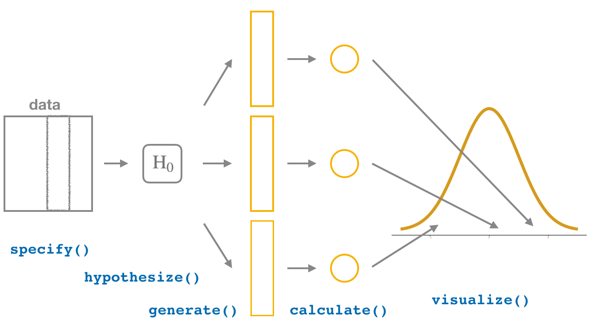

```{r}
library(tidyverse)
library(readr)
library(infer)

dat_1prop <- read_rds("./data/dat_1prop.rds")
dat_2prop <- read_rds("./data/dat_2prop.rds")
dat_1mean <- read_rds("./data/dat_1mean.rds")
```

## Outline

-   HW1 overview

-   Inference using Hypothesis testing

    -   General workflow for different kinds of data

-   Real-world data exercise

## Conceptual Model

::: incremental
-   What are we trying to do

    -   observed/sampled data -\> population inference

-   Generate a hypothesis

    -   Through descriptive/exploratory statistics

-   Test the Hypothesis

    -   Create a suitable 'null' hypothesis
    -   Check if we have enough evidence to reject the null hypothesis
:::

## Lets take an example: Example 1

According to a national report, 50% of rural respondents believe that climate change is caused by humans. You want to assess whether the proportion of rural respondents in your sample differs from the national average.

## What is our testable hypothesis

::: incremental
-   Null Hypothesis

    -   The proportion of rural respondents who believe in human-induced climate change is 0.5
    -   Hypothesis testing for one proportion

-   Alternate Hypothesis

    -   The proportion of rural respondents who believe in human-induced climate change is not equal to 0.5
    -   2-sided hypothesis test
:::

## Descriptive Analysis

```{r echo=TRUE}
ggplot(data = dat_1prop, aes(x = climhuman)) +
  geom_bar()
```

## Calculate Proportion

-   One nominal variable

```{r echo=TRUE}
dat_1prop |> 
  summarize(prop_clim = sum(climhuman=="yes")/40)

p_hat <- dat_1prop|>
  specify(response = climhuman, success = "yes")  |>
  calculate(stat = "prop")
p_hat
```

## Calculate Null Distribution

```{r echo=TRUE}
null_distn_one_prop <- dat_1prop |>
  specify(response = climhuman, success = "yes") |>
  hypothesize(null = "point", p = 0.5) |>
  generate(reps = 10000) |>
  calculate(stat = "prop")
```

## Calculate P value

```{r echo=TRUE}
null_distn_one_prop |>
 visualize() +
  shade_p_value(obs_stat = p_hat, direction = "both")

pvalue <- null_distn_one_prop |>
  get_pvalue(obs_stat = p_hat, direction = "both")
pvalue
```

## Calculate Confidence Interval

```{r echo=TRUE}
boot_distn_one_prop <- dat_1prop |>
  specify(response = climhuman, success = "yes") |>
  generate(reps = 10000) |>
  calculate(stat = "prop")

ci <- boot_distn_one_prop |>
  get_ci()
ci
```

## Draw Confidence Interval

```{r echo=TRUE}
boot_distn_one_prop |>
  visualize() +
  shade_ci(endpoints = ci) +
  geom_vline(xintercept = 0.5,
             color = "black")
  
```

## Through Formulae

```{r echo=TRUE}
prop.test(
  x = table(dat_1prop$climhuman),
  n = length(dat_1prop$climhuman),
  alternative = "two.sided",
  p = 0.5,
  correct = FALSE
)
```

## Conclusion

::: incremental

-   Do we reject the null hypothesis?

    -   No.
    -   We are not very confident that our results are NOT due to sampling variability

:::

## A General Workflow

{fig-align="center"}

## Your turn: Lab 6

-   Does place matter?

    -   Are urban residents more likely to believe that climate change is caused by humans, as compared to rural residents?

## What is our testable hypothesis

::: incremental
-   Null Hypothesis

    -   The proportion of urban respondents who believe in human-induced climate change is the same as the proportion of rural residents
    -   Hypothesis testing for 2 proportions

-   Alternate Hypothesis

    -   The proportion of urban respondents who believe in human-induced climate change is the greater than the proportion of rural residents
    -   one-sided hypothesis test
:::

## Descriptive Analysis

```{r echo=TRUE}
ggplot(dat_2prop, aes(x = area_type, fill = climhuman)) +
  geom_bar(position = "fill") +
  labs(x = "Area Type", y = "Proportion (Climate change caused by humans)") +
  coord_flip()
```

## Calculate Difference in Proportion

-   2 nominal variables

```{r echo=TRUE}

dat_2prop |>
  group_by(area_type) |>
  summarize(prop_clim = sum(climhuman=="yes")/length(climhuman))

d_hat <- dat_2prop |>
  specify(climhuman ~ area_type, success = "yes") |>
  calculate(stat = "diff in props", order = c("urban", "rural"))
d_hat
```

## Calculate Null Distribution

```{r echo=TRUE}
set.seed(2018)
null_distn_two_props <- dat_2prop |>
  specify(climhuman ~ area_type, success = "yes") |>
  hypothesize(null = "independence") |>
  generate(reps = 10000) |>
  calculate(stat = "diff in props", order = c("urban", "rural"))
```

## Calculate P value

```{r echo=TRUE}
null_distn_two_props |>
  visualize() +
  shade_p_value(obs_stat = d_hat, direction = "greater")

pvalue <- null_distn_two_props  |>
  get_pvalue(obs_stat = d_hat, direction = "greater")
pvalue
```

## Calculate Confidence Interval

```{r echo=TRUE}
boot_distn_two_props <- dat_2prop |>
  specify(climhuman ~ area_type, success = "yes") |>
  generate(reps = 10000) |>
  calculate(stat = "diff in props", order = c("urban", "rural"))

ci <- boot_distn_two_props |>
  get_ci()
ci
```

## Draw Confidence Interval

```{r echo=TRUE}
boot_distn_two_props |>
  visualize() +
  shade_ci(endpoints = ci) +
  geom_vline(xintercept = 0,
             color = "black")
  
```

## Through Formulae

```{r echo=TRUE}
prop.test(x = c(45, 24), n = c(60, 40),
              alternative = "greater")
```

## Conclusion

## Example 3

According to the same national report, the average age of respondents who believe that climate change is caused by humans is 24 years. You feel that older people in your study area are more aware too and hence think that your area may have a comparatively older population that believes in human-induced climate change.

## What is our testable hypothesis

::: incremental
-   Null Hypothesis

    -   The mean age of those who believe in human-induced climate change is the same as national average (23)
    -   Hypothesis testing for one mean

-   Alternate Hypothesis

    -   The mean age of those who believe in human-induced climate change is \> 23
    -   one-sided hypothesis test
:::

## Descriptive Analysis

```{r echo=TRUE}
# Lets look at distribution of those say yes
dat_1mean <- dat_1mean |>
  filter(climhuman == "yes")

ggplot(data = dat_1mean, mapping = aes(x = age)) +
  geom_histogram(binwidth = 3, color = "white")
```

## Calculate the Sample mean

-   One continuous variable

```{r echo=TRUE}

summary(dat_1mean$age)

x_bar <- dat_1mean |>
  specify(response = age) |>
  calculate(stat = "mean")
x_bar

```

## Calculate Null Distribution

```{r echo=TRUE}
set.seed(2018)

null_distn_one_mean <- dat_1mean |>
  specify(response = age) |>
  hypothesize(null = "point", mu = 23) |>
  generate(reps = 10000) |>
  calculate(stat = "mean")
```

## Calculate P value

```{r echo=TRUE}
null_distn_one_mean |>
  visualize() +
  shade_p_value(obs_stat = x_bar, direction = "greater")

pvalue <- null_distn_one_mean |>
  get_pvalue(obs_stat = x_bar, direction = "greater")
pvalue
```

## Calculate Confidence Interval

```{r echo=TRUE}
boot_distn_one_mean <- dat_1mean |>
  specify(response = age) |>
  generate(reps = 10000) |>
  calculate(stat = "mean")

ci <- boot_distn_one_mean |>
  get_ci()
ci
```

## Draw Confidence Interval

```{r echo=TRUE}
boot_distn_one_mean |>
  visualize() +
  shade_ci(endpoints = ci) +
  geom_vline(xintercept = 23,
             color = "black")
  
```

## Through formulae

```{r echo=TRUE}
t_test_results <- dat_1mean |>
  t_test(
    formula = age ~ NULL,
    alternative = "greater",
    mu = 23
  )
t_test_results
```

## Conclusion

## Example 4

-   Does Age matter?

    -   Are younger residents more likely to believe that climate change is caused by humans, as compared to older residents?

## What is our testable hypothesis

::: incremental
-   Null Hypothesis

    -   There is no association between age and beliefs in human-induced climate change
    -   Mean age is same for those who believe in human-induced climate change compared to those who do not
    -   Hypothesis testing for 2 means (independent samples)

-   Alternate Hypothesis

    -   The mean age is lower for those who believe in human-induced climate change compared to those who do not
    -   one-sided hypothesis test
:::

## Descriptive Analysis

```{r echo=TRUE}
dat_2means <- read_rds("./data/dat_1mean.rds")
ggplot(dat_2means, aes(x = climhuman, y = age)) +
  geom_boxplot() +
  stat_summary(fun = "mean", geom = "point", color = "red")
```

## Calculate Difference in means

-   1 continuous variable, One nominal variable

```{r echo=TRUE}

dat_2means |>
  group_by(climhuman) |>
  summarize(mean_age= mean(age))

d_hat <- dat_2means |>
  specify(age ~ climhuman) |>
  calculate(
    stat = "diff in means",
    order = c("yes", "no")
  )
d_hat
```

## Calculate Null Distribution

```{r echo=TRUE}
set.seed(2018)
null_distn_two_means <- dat_2means |>
  specify(age ~ climhuman) |>
  hypothesize(null = "independence") |>
  generate(reps = 10000) |>
  calculate(
    stat = "diff in means",
    order = c("yes", "no")
  )
```

## Calculate P value

```{r echo=TRUE}
null_distn_two_means |>
  visualize() +
  shade_p_value(obs_stat = d_hat, direction = "less")

pvalue <- null_distn_two_means |>
  get_pvalue(obs_stat = d_hat, direction = "less")
pvalue
```

## Calculate Confidence Interval

```{r echo=TRUE}
boot_distn_two_means <- dat_2means |>
  specify(age ~ climhuman) |>
  generate(reps = 10000) |>
  calculate(stat = "diff in means", order = c("yes", "no"))

ci <- boot_distn_two_means |>
  get_ci()
ci
```

## Draw Confidence Interval

```{r echo=TRUE}
boot_distn_two_means |>
  visualize() +
  shade_ci(endpoints = ci) +
  geom_vline(xintercept = 0,
             color = "black")
  
```

## Through formulae

```{r echo=TRUE}
t.test(age ~ climhuman, data = dat_2means, var.equal = FALSE,
        alternative = "less")
```

## Conclusion

## Example 5

-   Does Climate change education matter?

    -   Suppose the same people in your study were surveyed before and after an educational campaign about climate change.
    -   They were assigned “climate concern score” (from 1–10) before and after the campaign
    -   Are residents more concerned about human-induced climate change after a climate change educational campaign?
    -   

## What is our testable hypothesis

::: incremental
-   Null Hypothesis

    -   The campaign had no impact
    -   Mean score is same before and after the compaign
    -   Hypothesis testing for 2 means (paired samples)

-   Alternate Hypothesis

    -   The campaign had a positive impact
    -   Mean score is higher after the campaign as compared to before
    -   one-sided hypothesis test
:::

## Descriptive Analysis

```{r}
dat_2means_paired <- read_rds("./data/dat_2means_paired.rds")
dat_2means_paired <- dat_2means_paired |>
  mutate(id = 1:100)

d2mp_long <- dat_2means_paired |>
  select(id,concern_before,concern_after) |>
  pivot_longer(cols = concern_before:concern_after)

ggplot(d2mp_long, aes(
  x = name, y = value,
  color = name, shape = name
)) +
  geom_boxplot(
    show.legend = FALSE,
    outlier.shape = "triangle"
  ) +
  geom_text(aes(label = id),
    color = "black",
    hjust = rep(c(-0.15, 1.3), each = 100),
    show.legend = FALSE, size = 3
  ) +
  geom_line(aes(group = id), color = "grey", linewidth = 0.25) +
  geom_point(show.legend = FALSE) + 
  labs(
    x = "Tire brand",
    y = NULL,
    title = "Original data"
  ) +
  theme_minimal()
```

## Calculate Difference in means

-   2 paired continuous variables (?)

```{r}
dat_diff <- d2mp_long |>
  group_by(id) |>
  summarize(pair_diff = diff(value)) |>
  ungroup()
```

```{r echo=TRUE}

d_hat <- dat_diff |>
  specify(response = pair_diff) |>
  calculate(stat = "mean")
d_hat

ggplot(dat_diff, aes(x = pair_diff)) +
  geom_histogram(binwidth = 0.04, color = "white")
```

## Calculate Null Distribution

-   Very similar to the One mean example (Example 3)

```{r echo=TRUE}

set.seed(2018)
null_distn_paired_means <- dat_diff |>
  specify(response = pair_diff) |>
  hypothesize(null = "point", mu = 0) |>
  generate(reps = 10000) |>
  calculate(stat = "mean")
```

## Calculate P value

```{r echo=TRUE}
null_distn_paired_means |>
  visualize() +
  shade_p_value(obs_stat = d_hat, direction = "greater")

pvalue <- null_distn_paired_means|>
  get_pvalue(obs_stat = d_hat, direction = "greater")
pvalue
```

## Calculate Confidence Interval

```{r echo=TRUE}
boot_distn_paired_means <- dat_diff |>
  specify(response = pair_diff) |>
  generate(reps = 10000) |>
  calculate(stat = "mean")

ci <- boot_distn_paired_means |>
  get_ci()
ci
```

## Draw Confidence Interval

```{r echo=TRUE}
boot_distn_paired_means |>
  visualize() +
  shade_ci(endpoints = ci) +
  geom_vline(xintercept = 0,
             color = "black")
  
```

## Through formulae

```{r echo=TRUE}
t_test_results <- dat_diff |>
  t_test(
    formula = pair_diff ~ NULL,
    alternative = "less",
    mu = 0
  )
t_test_results
```

## Conclusion

## Next Class

-   Errors in Hypothesis Testing
-   Exploratory Spatial Analysis
