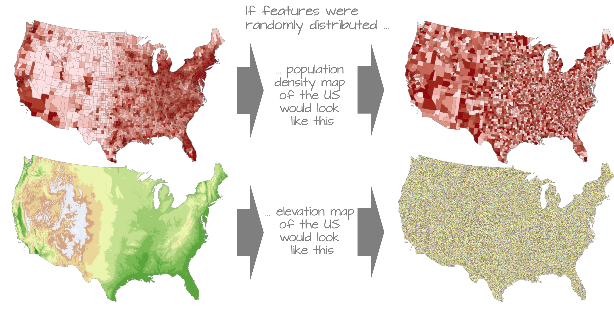
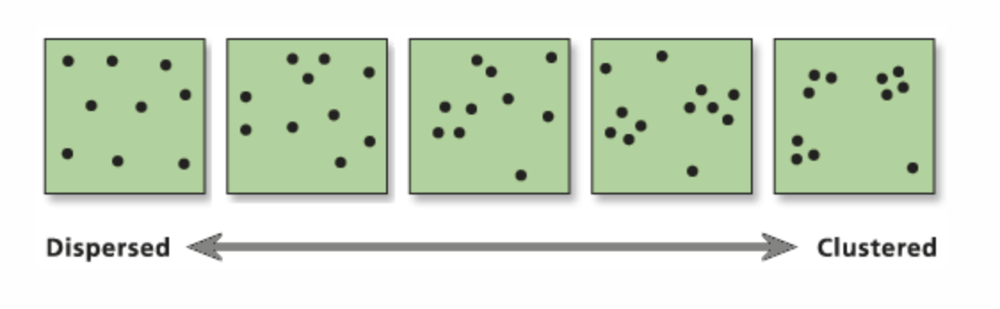
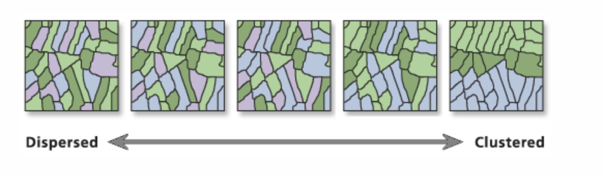

## Outline

-   Errors in Hypothesis Testing

-   Spatial Autocorrelation

-   Spatial Patterns

## Spatial Autocorrelation

> *“Everything is related to everything else, but near things are more related than distant things.”* — **Tobler’s First Law** (Tobler, 1970)

## No Spatial Autocorrelation

## Exploratory Spatial Data Analysis 

::: incremental

-   Examine the Spatial nature/structure of data/patterns

    -   Is there spatial autocorrelation in my data
    -   Is crime concentrated (clustered) in a particular location
    -   Why is average Pm2.5 higher in west vs east
    -   Where are hotspots of salmonella outbreak in the city?
    -   What is the "process" driving the pattern?
    
:::

## Spatial Patterns

- Point Patterns

  -   Focus on location of points (features)

## Spatial Patterns

- Area Patterns

  -   Focus on location of values (attributes)

## Why are we interested in exploring Spatial Patterns

## Patterns and Processes

- Main Difference

    -   A Spatial "pattern" is the result of some spatial "process"
    -   We map patterns (observe, describe)
    -   We model processes (understand, explain)
    
## Fundamental "Spatial" Hypothesis

::: incremental

-   H(A): The observed patterns are being driven by some spatial process

-   What will be the NULL Hypothesis?

    -   Complete Spatial Randomness (CSR)
    
:::

## Complete Spatial Randomness

::: incremental

-   Is the observed Spatial Pattern occuring randomly?
-   Comparison tests for whether there is a spatial pattern

    -   Is the observed pattern different than a random pattern?
    
## Spatial Process {.smaller}

::: incremental

-    Why might there not be CSR?
-   First Order Effects

    -   Spatial Trend or Intensity
    -   Observed spatial variation due to extrinsic (external) factor(s)
    
-   Second Order Effects

    -   Interaction and Autocorrelation
    -   Spatial Variation due to interaction or intrinsic factors
    
-   Similar to classical Statistics

    -   Mean (first order moment)
    -   Variance/Variation (second order moment)
    
:::

## Spatial Process

