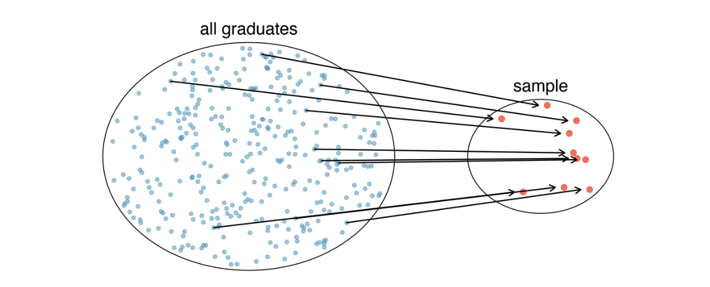
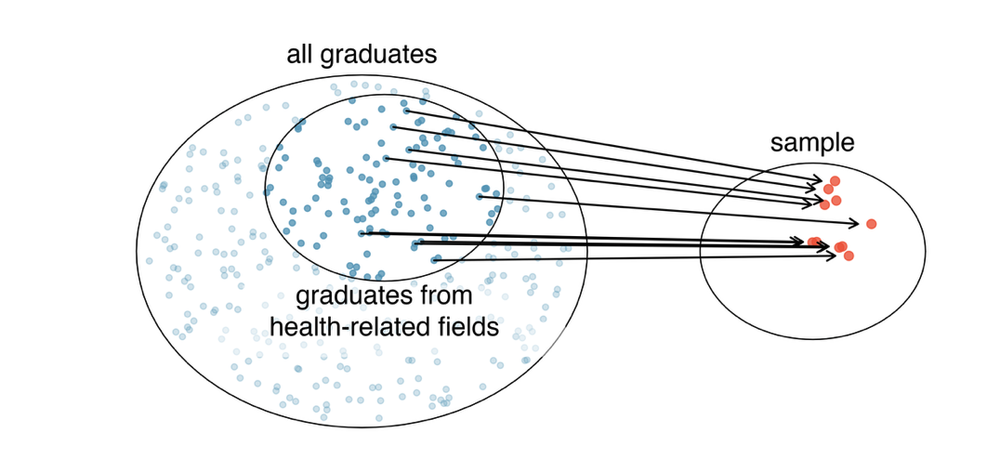
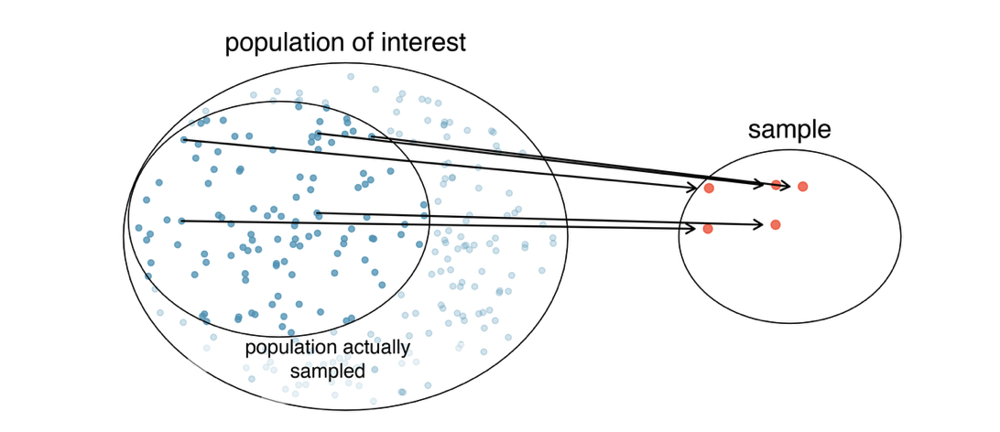
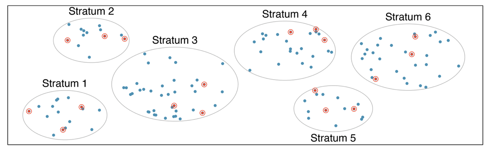
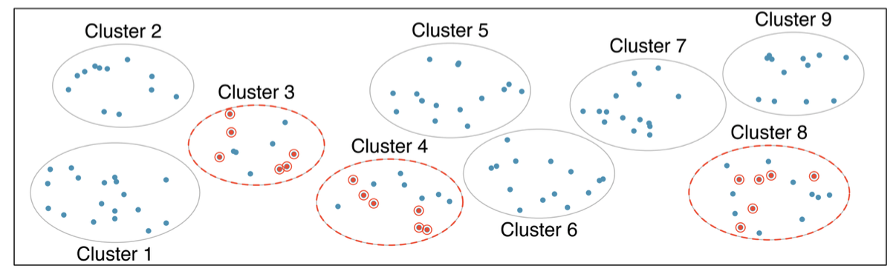

```{r}
library(tidyverse)
library(readr)
```

## Outline

-   Populations and Samples

-   Parameter and Statistics

-   Elements and Methods of Sampling

## Populations and Samples {.smaller}

::: incremental
-   What is the average mercury content in Salmon in the Pacific Ocean?
-   **Target Population**
    -   All fish in the Pacific
-   **Observation/Case**
    -   Each fish
-   **Census**
    -   Every Salmon in the Atlantic
-   **Sample/Sampled population**
    -   A fraction of the salmon
-   **Sampling Frame**
    -   Batches of fish from all fishing boats docking in NYC
-   **Sampling Area**
    -   Fishing area of all NYC docked fishing boats
:::

## Populations and Samples {.smaller}

::: incremental
-   Your turn

    -   Over the last five years, what is the average time to complete a degree for USC undergrads?

    -   Does a new drug reduce the number of deaths in patients with severe lung disease?

    -   What is the pattern of environmental change associated with tourism in Yellow Stone National Park?

    -   Did public attitude in Asheville towards flood management change after Hurricane Helene?

    -   How do neighborhood characteristics influence hospital emergency room utilization in Columbia SC?
:::

## Parameters and Statistics

::: incremental
-   Sample Statistic
    -   Calculated on a sample
-   Population Parameter
    -   Calculated or considered on the entire population
    -   Often hard to directly calculate, but is what we are trying to infer.
:::

## A note about Anecdotal Evidence (anecdata) {.smaller}

::: incremental
-   Consider the following possible responses to the three research questions:
    1.  A man on the news got mercury poisoning from eating salmon, so the average mercury concentration in salmon must be dangerously high.

    2.  I met two students who took more than 7 years to graduate from USC, so it must take longer to graduate at USC than at many other colleges.

    3.  My friend’s dad had lung failure and died after they gave him a new lung diseases drug, so the drug must not work.
-   Haphazard collection vs Systematic Collection
:::

## Why Sample? {.smaller}

-   Necessity

    -   Efficiency/Cost Effectiveness?

    -   Detail?

    -   Timeliness?

    -   Accuracy?

-   Eg. US Census vs American Community Survey

## Sampling from a population {.smaller}

::: incremental
-   Random Sampling

{.fragment width="80%"}
:::

## Sampling from a population {.smaller}

::: incremental
-   Suppose we ask a student who happens to be majoring in nutrition to select several graduates for the study.

    -   Which students do you think they might pick?
    -   Do you think their sample would be representative of all graduates?
:::

{.fragment width="80%"}

## Sampling from a population

::: incremental
-   Non-response bias

    -   Bias due to non-response rate
:::

{.fragment width="80%"}

## Sampling from a population {.smaller}

::: incremental
-   Convenience Sampling

    -   Sending a political survey to your friends
    -   Amazing Ratings
        -   50% negative reviews
        -   Does that mean 50% of buyers are dissatisfied?
:::

## Sampling error {.smaller}

::: incremental
-   Randomness

-   Sampling Precision

    -   Sample size (small vs big sample)

-   Sampling Bias/Inaccuracy

    -   Wrong Sampling Frame

    -   Wrong Sampling Design
:::

## Types of Sampling Designs {.smaller}

::: incremental
-   Probability Sampling Designs

    -   can calculate the probability of each individual in a sample

-   Non-probability Sampling Designs

    -   I go by vibes only!
    -   CAN STILL BE USEFUL for non-inferential statistics
        -   You can still describe your sample
:::

## Simple Random Sampling

::: incremental
-   Each case in the population has an equal chance of being sampled
-   Knowing information about one case does not tell us anything about another case
:::

{.fragment width="80%"}

## Stratified (Random) Sampling

::: incremental
-   Divide population into groups (strata) based on a common characteristic
-   randomly sample within each group
-   Works well when cases within groups are very similar
:::

{.fragment width="80%"}

## Cluster Sampling {.smaller}

::: incremental
-   Break population into many groups (clusters)
-   Randomly choose a fixed number of clusters
-   Sample everyone in the cluster
-   works best when cases within clusters are very diverse
-   but clusters themselves dont look different from each other
:::

{.fragment width="80%"}

## Multi-Stage Cluster Sampling

::: incremental
-   Similar to cluster sampling, except..
-   randomly choose a sample within each selected cluster
:::

{.fragment width="80%"}

## Case studies

Suppose we are interested in estimating the malaria rate in a densely tropical portion of rural Indonesia.

We learn that there are 30 villages in that part of the Indonesian jungle, each more or less like the next, but the distances between the villages are substantial.

We want to test 150 individuals for malaria. What sampling method should we use?

## Case studies

On a large college campus first-year students and sophomores live in dorms located on the eastern part of the campus and juniors and seniors live in dorms located on the western part of the campus.

Suppose you want to collect student opinions on a new housing structure the college administration is proposing and you want to make sure your survey equally represents opinions from students from all years.

## Case Studies {.smaller}

A statistics student who is curious about the relationship between the amount of time students spend on social networking sites and their performance at school decides to conduct a survey. Various research strategies for collecting data are described below. In each, name the sampling method proposed and any bias you might expect.

a.  They randomly sample 40 students from the study’s population, give them the survey, ask them to fill it out, and bring it back the next day.

b.  They give out the survey only to their friends, making sure each one of them fills it out.

c.  They post a link to an online survey on Facebook and ask their friends to fill it out.

d.  They randomly sample 5 classes and asks a random sample of students from those classes to fill out the survey.

## Case Studies {.smaller}

A city council has requested a household survey be conducted in a suburban area of their city. The area is broken into many distinct and unique neighborhoods, some including large homes, some with only apartments, and others a diverse mixture of housing structures. For each part below, identify the sampling methods described, and describe the statistical pros and cons of the method in the city’s context.

1.  Randomly sample 200 households from the city.

2.  Divide the city into 20 neighborhoods, and then sample 10 households from each neighborhood.

3.  Divide the city into 20 neighborhoods, randomly sample 3 neighborhoods, and then sample all households from those 3 neighborhoods.

4.  Divide the city into 20 neighborhoods, randomly sample 8 neighborhoods, and then randomly sample 50 households from those neighborhoods.

5.  Sample the 200 households closest to the city council offices.
