```{r}
#| label: setup
#| include: false
# Core packages used across both parts
pkgs <- c(
  "sf","spdep","spData","tmap",
  "spatstat.data","spatstat.geom","spatstat.explore"
)
need <- pkgs[!pkgs %in% installed.packages()[,"Package"]]
if (length(need) > 0) install.packages(need, repos = "https://cloud.r-project.org")
invisible(lapply(pkgs, library, character.only = TRUE))
set.seed(531) # reproducibility for examples
```


## Recap & framing

-   A **point pattern** is a set of event locations in a defined **window**.
-   **First‑order**: variation in **intensity** (trend) across space.
-   **Second‑order**: **interaction** among events (clustering, inhibition) beyond intensity.

## Recap & framing

-   **CSR (Complete Spatial Randomness)** = homogeneous **Poisson** process.
    -   *First‑order*: constant intensity.
    -   *Second‑order*: no interaction.
-   Key practicalities: **window definition**, units/CRS, duplicates, edge effects.

## Highly recommended reading

-   https://mgimond.github.io/Spatial/chp14_0.html

    -   Chapter 13 for Wednesday

## First order effects

- Intensity

    -   How does the likelihood of observing a point change from one location to another
    -   Independent of presence/absence of other points
    -   Eg.
    
        -   Retail stores and population density
        -   Asthma and air pollution
        
        

## Some terms

- **Density**

    -   *Observed number of points per area*
    -   Directly Observable
    
- **Intensity**

    - Underlying rate/likehood/probability
    - What we *infer*
    - Property of the process that generated the pattern
    -   **homogenous** - constant intensity across study area
    -   **inhomogenous** - intensity varies across study area


## Global Density Method

-   Average number of points per unit area

    -   number of points / area
    
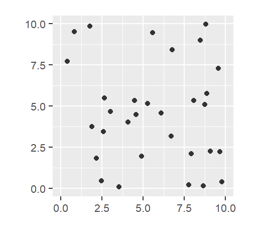

## Local density methods

-   Quadrat density
-   Kernel density estimation
-   several others
-   Assumption
    -   Inhomogeneity
    -   non stationarity
    
## Quadrat Density

-   Divide study area into quadrats
-   Calculate density in each quadrat

    -   Homogeneity within quadrats

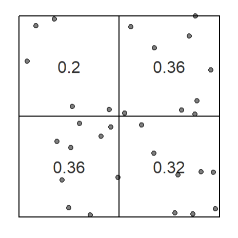

## Quadrat Density

-   Sensitive to choice of quadrats

    -   quadrats dont have to same size
    
-   Can be based on an external variable

    -   soil type, administrative region
    
## Quadrat Density

-   Often done using **tesselation**

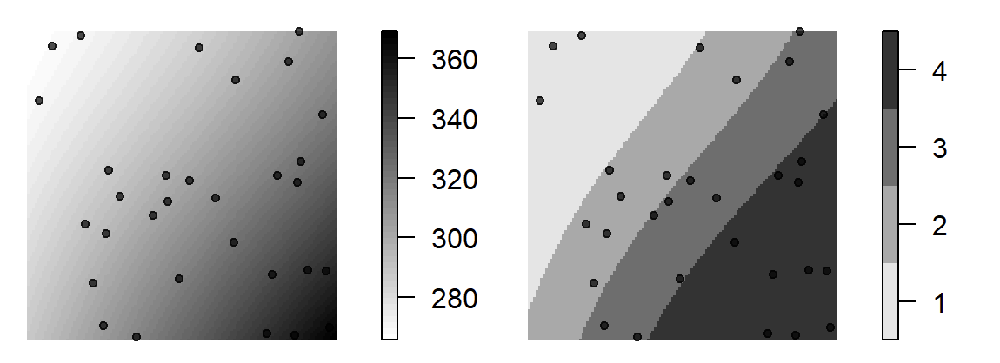)

## Quadrat Density {.smaller}

-   Sensitive to choice
    
    -   MAUP!!!

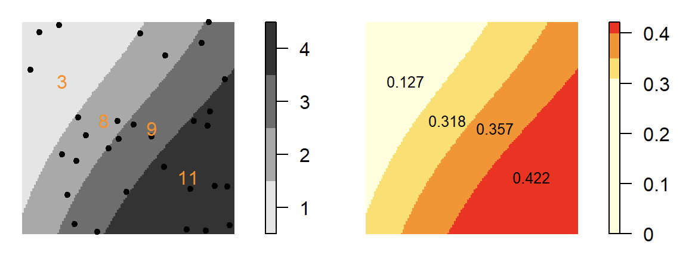

## Quadrat Density {.smaller}

-   Sensitive to choice
    
    -   MAUP!!!

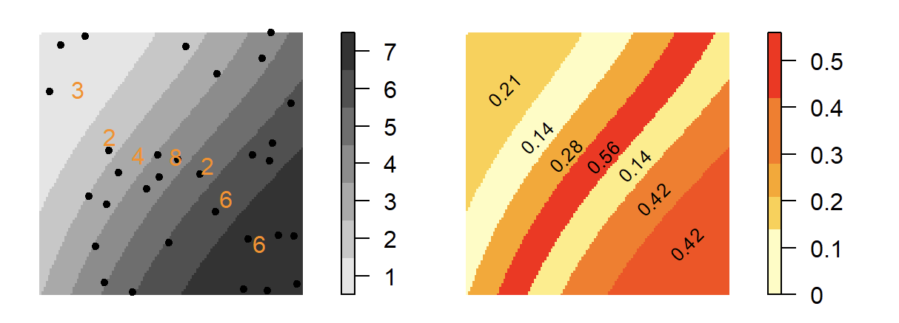

## Kernel Density Estimation

-   Estimation using a moving window

    -   defined by a *kernel*
    
        -   Degree of influence of neighbors
        -   Simple kernel
        -   Distance-weighted kernel
    

## Kernel Density Estimation

-    Simple Kernel
-    3x3 moving window

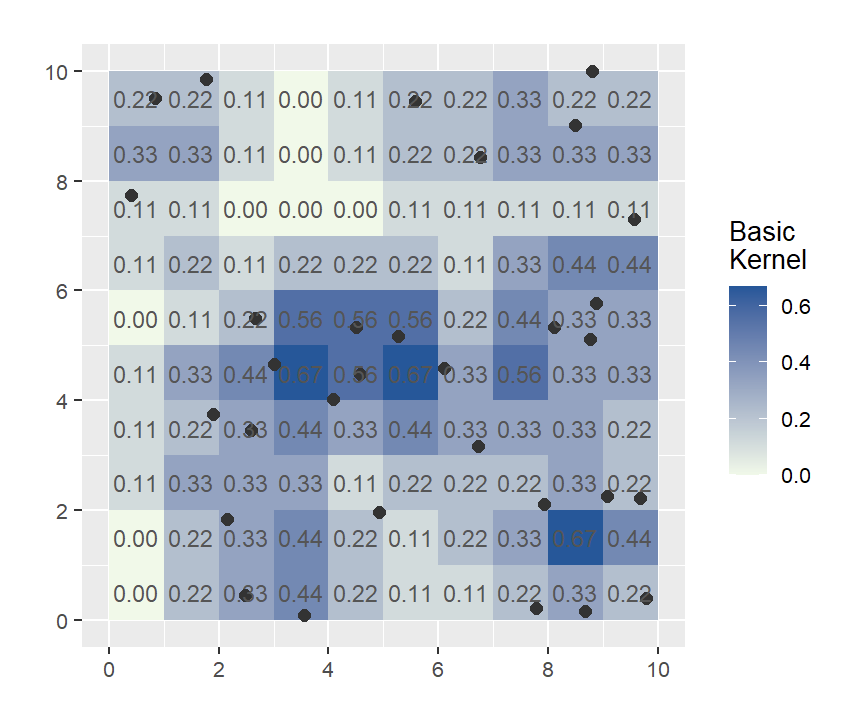 {width="50%"}

## Kernel Density Estimation

-    Distance-weighted Kernel

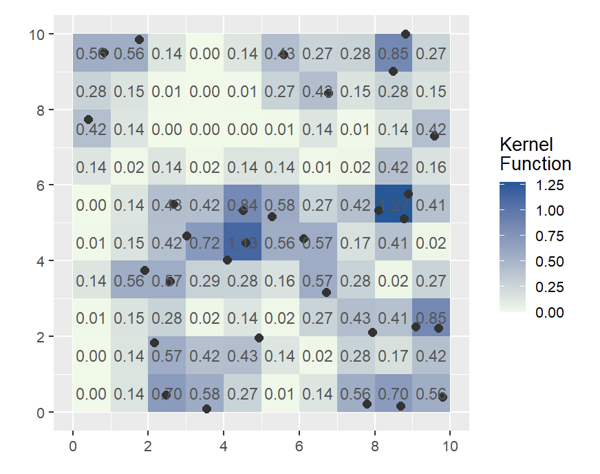

## Kernel Density Estimation

-    Distance-weighted Kernel

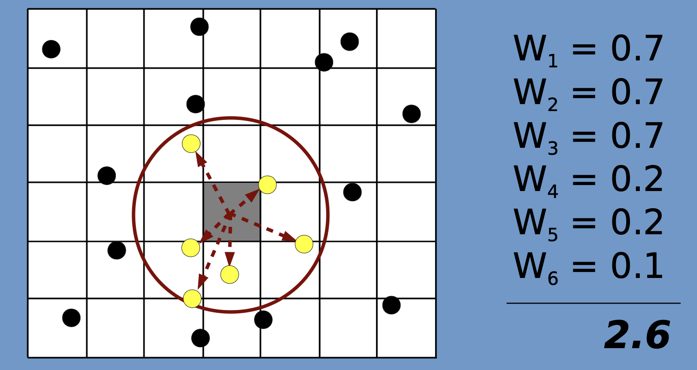

## Examples

## Second-order effects

-   Distance-based methods
    
    -   Compared to Density-based (first-order effects)
    -   How are points distributed relative to one another
    -   Is there potential for Spatial Interaction?
    
## Second-order effects

-   Average Nearest Neighbor (ANN)
-   Ripley's K and L functions
-   Pair Correlation Function

## Average Nearest Neighbor

-   Average distance between all nearest neighboring point pairs
-   Eg - ANN = 13.3 km

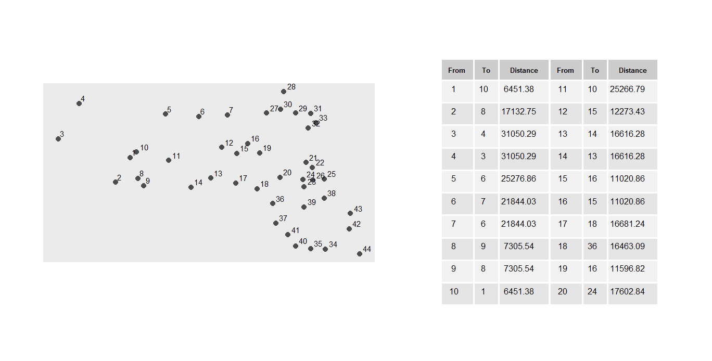

## Average Nearest Neighbor

-   Can be extended to higher orders
-   Can capture 'scale' of clustering

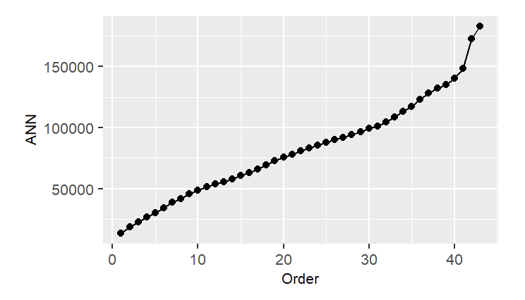

## Average Nearest Neighbor

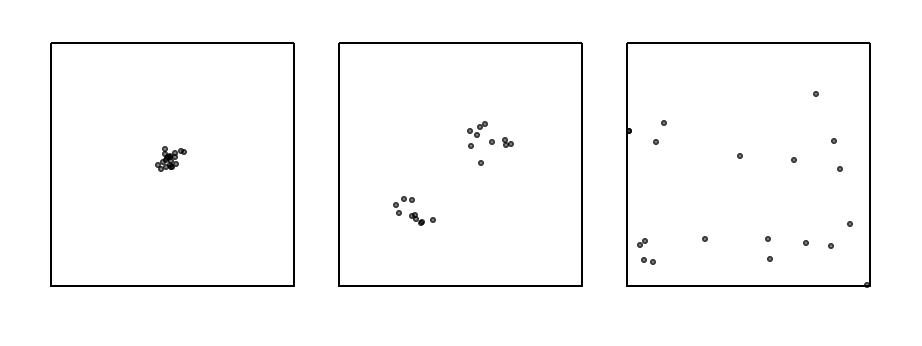

## Average Nearest Neighbor

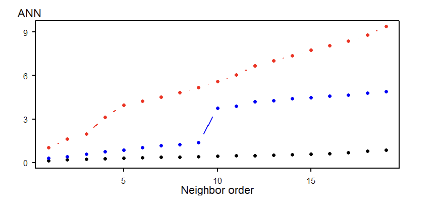

## K and L function

-   How does clustering and dispersion change and different spatial scales?
-   Considers all point pair distances

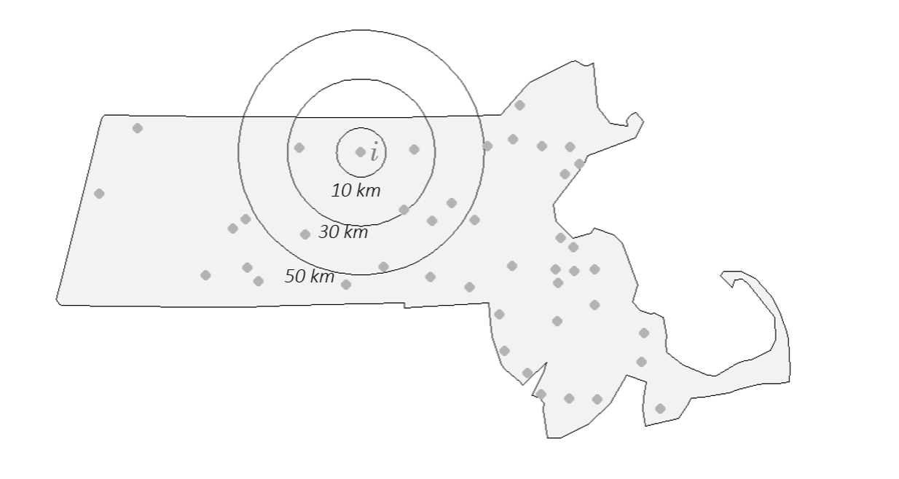


## K and L function


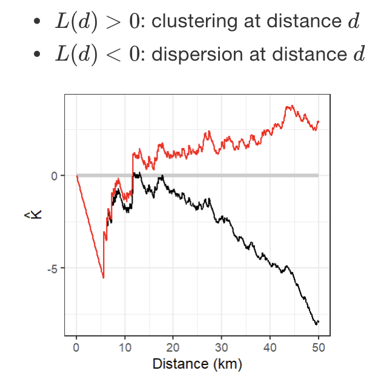

## Pair Correlation Function

-     Also referred to as the G function

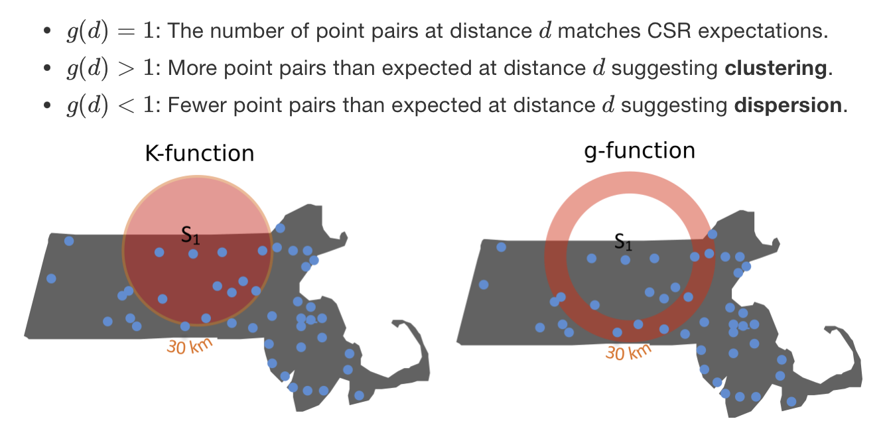

## Pair Correlation Function


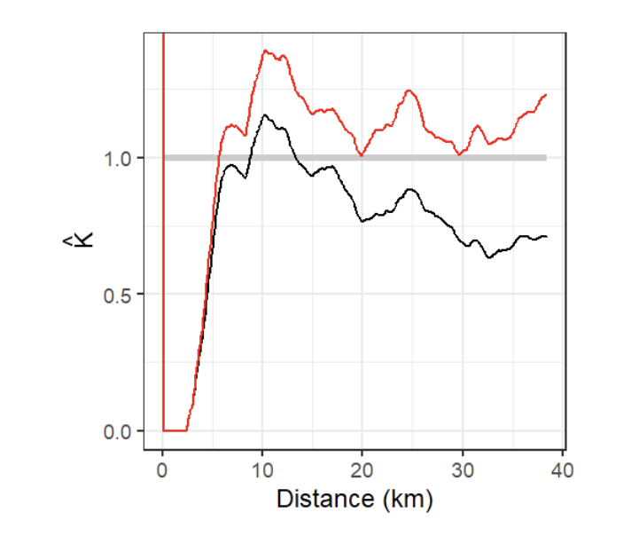

## first and second order effects

-   Stationarity/Inhomogeniety assumption
-   Isotropy assumption
-   Edge Effects

-   Controlling for first order effects
-   Controlling for second order effects